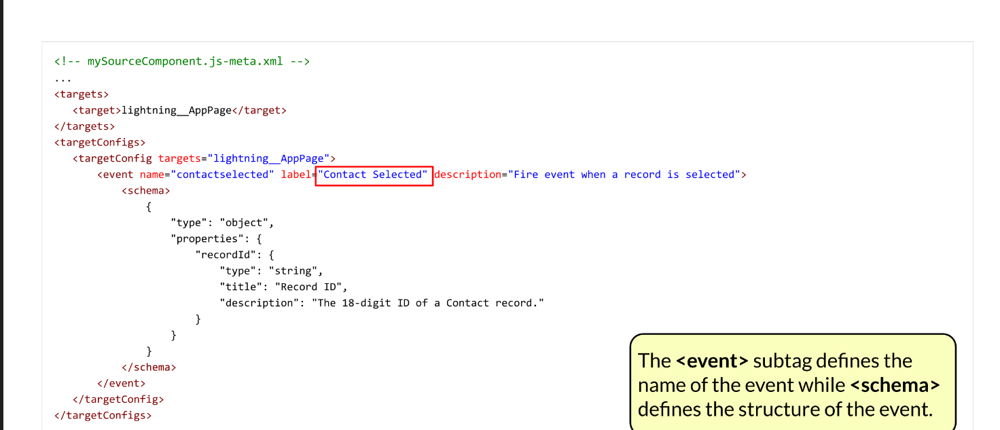

# Developer I

###

### &#x20;

### 👁️[Asincrono](https://developer.salesforce.com/trailhead/module/asynchronous\_apex?\_ga=2.87241425.875750910.1700039759-1875400034.1696324836) 

I test devono essere eseguiti in modo sincrono!\
Racchiudere le chiamate ai metodi tra Test.startTest() e Test.stopTest()

### Batch Apex 

Per operazioni sui record che non rispetterebbero i normali governor limits (es. pulizia ed archiviazione, fino a 50M di record): i record vengono processati in blocchi (l’ordine non è prestabilito) ed i limiti ripristinati ogni volta. Il fallimento di un batch non pregiudica l’esito degli altri.

#### Definizione classe

**Attenzione ai tre metodi caratteristici!**

public class MyBatchClass implements Database.Batchable\<sObjectLetterale!> {

_\[eventuali variabili di istanza, vedi Database.Stateful]_

public Database.QueryLocator | Iterable start(Database.BatchableContext bc) {

_operazioni di raccolta record…_

return Database.getQueryLocator(query per ottenere i record) | Iterable…;

}

public void execute(Database.BatchableContext bc, List<_oggetto_> records){

_processo sui record…_

}

public void finish(Database.BatchableContext bc){

_operazioni da eseguire al termine della totalità dei batch…_

}

}

#### Chiamata nel codice

MyBatchClass oggettoBatch = new MyBatchClass();

Id batchId = Database.executeBatch(oggettoBatch, _\[num. record/batch]_);

#### Note

1. In fase di test si può eseguire soltanto un batch, attenzione a non eccedere il numero di record stabilito
2. Il numero di record per batch predefinito è di 200
3. L’ID assegnato sopra è di un record di tipo _AsyncApexJob_
4. Se si eseguiranno callout implementare _Database.AllowsCallouts_
5. Se serve tracciare il totale di record lavorati con una variabile di istanza deve essere implementata anche la proprietà _Database.Stateful_
6. Si fa restituire un _Iterable_ al metodo _start_ se i record devono essere analizzati e pre-processati in sequenza (in questo caso si torna ai normali governor limits)

### Future Methods 

La loro definizione è molto semplice e possono essere facilmente impiegati, solitamente per callout a risorse esterne o quando devono essere eseguiti calcoli molto pesanti. L’ordine di esecuzione non è garantito, alcuni potrebbero avvenire anche in contemporanea.

#### Definizione classe

Basta premettere @future al metodo in questione, che tuttavia:

* Deve essere static void
* In input accetta solo tipi primitivi, perciò in caso di oggetti (che potrebbero essere cambiati nel tempo tra la chiamata e l’esecuzione) si devono usare i loro ID

Se si eseguiranno callout premettere @future(callout=true)

#### Note

1. Massimo 50 chiamate a future methods per invocazione Apex
2. I governor limits sono più ampi
3. Un future method non può chiamarne un altro ricorsivamente, neanche passando per un trigger intermedio (cfr. _Queuable Apex_)
4. Non hanno associati Apex job ID e non possono essere monitorati
5. In fase di test non si possono eseguire dei callout, se il metodo li prevede dovranno essere simulati
6. Raccogliere più callout possibili all’interno di uno stesso future method, anziché frammentarli
7. Possono racchiudere una chiamata a metodi sincroni in modo tale da renderli asincroni facilmente

### Queuable Apex 

Al contrario dei future methods possono lavorare con oggetti complessi e non solo i tipi primitivi; si possono chiamare a catena (un solo genitore, un solo figlio); sono monitorabili.

#### Definizione classe

public class SomeClass implements Queueable {

…

public void execute(QueueableContext context) {

…

}

}

#### Chiamata nel codice

MyQueueableClass oggettoQueueable = new MyQueueableClass(_\[parametri..]_);

Id jobId = System.enqueueJob(oggettoQueueable, \[asyncOptions]);

_Vedi asyncOptions nel codice notevole_

#### Note

1. Se si eseguiranno callout implementare Database.AllowsCallouts
2. In fase di test non si possono chiamare job secondari, pertanto se sono necessari si dovrà premettere loro la condizione if( not(Test.isRunningTest()) )
3. In una sola transazione si possono inserire fino a 50 job queuable
4. Solo per Developer Edition e org in prova, si possono concatenare fino a 5 livelli di job; altrimenti, non ci sono limiti

### Schedulable Apex 

In questo modo i processi vengono lanciati in momenti prestabiliti, con una certa cadenza. Spesso si utilizzano per eseguire operazioni in batch.

#### Definizione classe

public class SomeClass implements Schedulable {

…

public void execute(SchedulableContext ctx) {

…

}

}

#### Chiamata nel codice

MySchedulableClass oggettoSchedulable = new MySchedulableClass();\
String CRON = ‘sec min ore ggMese mese ggSett \[anno]’;\
String⚠ jobID = System.schedule(nomePersonalizzato, CRON, oggettoSchedulable);

* Viene considerata la zona oraria dell’utente, ma il contesto è quello del sistema, con tutti i permessi
* Per la formattazione della stringa CRON vedere _Apex Scheduler_ nella documentazione
* La calendarizzazione può essere fatta anche da _Setup > Apex Classes > Schedule Apex_

#### Note

1. Si possono schedulare al massimo 100 job.
2. Per informazioni sui job schedulati studiare gli oggetti _CronTrigger_ e _CronJobDetail_ nella documentazione
3. Se si eseguiranno callout implementare _Database.AllowsCallouts_; quelli sincroni a servizi esterni non possono essere eseguiti, bisogna passare per dei _future methods_
4. Per testare il codice inserire una espressione CRON qualsiasi e possibilmente una verifica che non ci siano job già programmati; il sistema lancerà il job in modo sincrono ignorando l’espressione
5. Attenzione a schedulare da un trigger per non superare i governor limits specifici!
6. Non si possono eseguire callout **sincroni** da codice schedulato

### Note generali 

1. L’istanziamento della classe si può fare anche direttamente nel metodo di chiamata come\
   _new nomeClasse()_
2. Monitoraggio:
3. Per controllare lo stato dei job passati e futuri cercare _Apex Jobs;_ per vedere i soli batch c’è un link in quella pagina
4. Per controllare lo stato della coda e modificare l’ordine di esecuzione dei job in attesa cercare _Apex Flex Queue_, che però non mostra i Future Jobs (tornare su Apex Jobs)
5. Una query SOQL tipo per ricavare informazioni su job è\
   AsyncApexJob jobInfo = \[SELECT Status, NumberOfErrors FROM AsyncApexJob WHERE Id = :jobID];

### Aura components 

### File 

I principali sono:

* _Component_ _/ App_ (Nome .cmp|.app)
* markup del componente oppure di una app stand-alone
* esplicita legami con eventuali CSS e JS e le opzioni di configurazione
* _Controller_ (ComponentController.js)
* per operare con eventi JS lato client
* mappa _nomeFunzione_ : function(component, event, helper){_codice_…}
* _Helper_ (ComponentHelper.js)
* funzioni accessibili da qualsiasi altro punto del JS
* mappa come sopra
* _Style_ (Component.css): proprietà grafiche del markup del componente

Gli altri sono:

* Component.auradoc
* una sorta di guida al componente e al codice di cui è costituito
* le punta la URL \<myDomain>.lightning.force.com/componentReference/suite.app
* Component.design:
* opzioni di configurazione
* attributi esposti al Lightning App Builder
* per indicare restrizioni ai dispositivi supportati ed all’uso nella sola record page
* Component.svg: icona personalizzata in SVG
* ComponentRenderer.js: codice per modificare il rendering di default

### Elementi notevoli del codice 

#### Markup

* {}
* \<aura:application>\
  Racchiude tutto il markup per _un’applicazione_ (accessibile da _nomeIstanza_/c/_nomeApp_.app_)_
* access = public | global
* controller = _namespace_._nomeController_ (per Apex)
* extends = _namespace_:_nomeApp_; ltng:outApp per includerla in Visualforce
* extensible (Boolean), default false
* implements = int1, int2, … : vedi le _interfacce_
* \<aura:component>\
  Markup per un _componente_
* \<c:_componenteFiglio_>\
  Inserisce un componente figlio definito separatamente
* \<aura:attribute>\
  ⚠️Deve corrispondergli un \<design:attribute> nel _design_
* \<aura:event>
* access, extends (come sopra)
* type = COMPONENT | APPLICATION
* \<aura:interface>
* access, extends
* \<aura:dependency>\
  Da usare quando ci si appoggia ad un elemento che non è menzionato esplicitamente nel markup e si vuole istanziare il componente “indirettamente”, per esempio tramite JS in una Visualforce
* resource = indirizzo
* type = COMPONENT (def) | APPLICATION | EVENT | INTERFACE | MODULE (LWC)
* \<ltng:require>
* scripts=”{!$Resource.script1}, {!$Resource.script2, …}”\
  per JS esterno, da caricare come Static resource
* 

Interfacce

* **Visibilità**
* flexipage:availableForAllPageTypes: in ogni Lightning Page + utility bar
* flexipage:availableForRecordHome: solo nelle Record Page
* clients:availableForMailAppAppPage: per mail app, anche esterne
* **Accesso al record**
* force:hasRecordId: per accedere all’Id
* force:hasSObjectName: per accedere all’Api Name

#### Design

* \<design:attribute>\
  name viene referenziato nel codice del componente, label figura nelle proprietà, nell’App Builder
* \<design:supportedFormFactors> con \<design:supportedFormFactor>\
  Large e/o Small rispettivamente per supportare solo fisso o mobile; se non presenti, ereditano dalla pagina
* \<sfdc:objects> con \<sfdc:object>\
  Per specificare gli Api Name di specifici oggetti a cui restringere il supporto, per Record page

### Eventi

* Quelli dei _Lightning Components_ possono essere recepiti e gestiti soltanto all’interno dello stesso componente oppure dalla gerarchia dei suoi contenitori
* Quelli dell’applicazione possono essere gestiti da qualunque componente che abbia una opportuna funzione nel proprio handler
* init\
  Dal componente più interno fino all’applicazione
* render
* rerender
* afterRender
* unrender
* [components\_devconsole\_configs.htm](https://developer.salesforce.com/docs/atlas.en-us.lightning.meta/lightning/components\_devconsole\_configs.htm)

### 👍Classi 

### Modificatori 

#### Di accesso (accessModifier)

* private (default): accessibilità solo dal codice interno alla classe che contiene la variabile, il metodo, la classe interna
* protected: accessibilità dall’interno della classe e da quelle che la estendono
* public: accessibilità dall’interno del namespace e dell’applicazione
* global:accessibilità anche dall’esterno del namespace (es. per Web Service)
* Una classe interna può non presentare il modificatore (sarà private)
* ⚠️Una classe esterna può essere solo public o global; una di test anche private
* ⚠️Se un membro è global, anche la classe esterna deve esserlo

#### Di definizione (definitionModifier)

* virtual: la classe ammette estensioni ed override dei metodi dichiarati virtual a propria volta
* ⚠️Una classe può estenderne soltanto un’altra
* abstract: un metodo così dichiarato non è implementato; la classe è abstract se contiene almeno uno di questi metodi e dovrà essere estesa per poterli implementare
* static: il metodo o la variabile appartengono alla classe e non alle singole istanze, che ne condividono un’unica copia
* Solo le classi esterne possono avere membri statici
* Un metodo static non può essere protected
* ⚠️I membri statici non possono essere chiamati sulle singole istanze, ed i metodi statici non possono accedere ai valori propri delle istanze
* ⚠️Le variabili statiche possono essere aggiornate, ma conservano il loro valore solo nella transazione corrente
* static final: per una costante, il cui valore deve essere definito in concomitanza e non può più essere modificato
* transient: specifico per il codice di controller impiegati dalle pagine Visualforce, indica una variabile il cui valore deve essere escluso dal _viewState_ ovvero non ricalcolato ogni volta che la pagina viene aggiornata; utilizzabile anche nelle classi che implementano le interfacce _Batchable_ e _Schedulable_

#### Della valutazione delle Sharing Rules

* Le opzioni sono with sharing, without sharing, inherited sharing e applicabili solo alle classi, esterne ed interne
* Le classi interne **non ereditano** l’impostazione di quella esterna
* Le classi estese ed implementate **ereditano** l’impostazione della classe padre

### Annotazioni 

* [@AuraEnabled](https://developer.salesforce.com/docs/atlas.en-us.apexcode.meta/apexcode/apex\_classes\_annotation\_AuraEnabled.htm): rende il metodo accessibile ad Aura Components e LWC
* cacheable = true: permette di salvarne i risultati in cache\
  ⚠️ Il metodo sarà utilizzabile solo per ottenere dati, non per modificarne
* [@Deprecated](https://developer.salesforce.com/docs/atlas.en-us.apexcode.meta/apexcode/apex\_classes\_annotation\_deprecated.htm): metodo, classe ecc. non possono più essere usate dal nuovo codice (continuano a funzionare)\

* [@Future](https://developer.salesforce.com/docs/atlas.en-us.apexcode.meta/apexcode/apex\_classes\_annotation\_future.htm): vedi _Future Methods_
* callout = true: abilita ai callout
* [@InvocableMethod](https://developer.salesforce.com/docs/atlas.en-us.apexcode.meta/apexcode/apex\_classes\_annotation\_InvocableMethod.htm): rende il metodo visibile a REST, Flow, Bot, Apex
* label, description danno informazioni
* callout = true abilita ai callout\
  (⚠️determinante se il flow deve decidere in autonomia come gestire le transazioni!)
* ⚠️incompatibile con altre annotazioni
* ⚠️il metodo dev’essere static e public / global; uno solo per classe
* [@InvocableVariable](https://developer.salesforce.com/docs/atlas.en-us.apexcode.meta/apexcode/apex\_classes\_annotation\_InvocableVariable.htm)
* [@IsTest](https://developer.salesforce.com/docs/atlas.en-us.apexcode.meta/apexcode/apex\_classes\_annotation\_isTest.htm): per classi esterne e metodi, public o private
* seeAllData = true: ignora qualsiasi restrizione sui dati; se posto true sulla classe, vale per tutti i metodi di test
* isParallel = true: tutte le classi così segnate possono far girare i test in parallelo (incompatibile con seeAllData)
* [@](https://developer.salesforce.com/docs/atlas.en-us.apexcode.meta/apexcode/apex\_classes\_annotation\_testsetup.htm)TestSetup: il metodo verrà eseguito per primo ed i record creati verranno riportati allo stato originario prima dell’esecuzione di ogni metodo di test della classe, infine rimossi
* ⚠️ per un solo metodo per classe, static void; non utilizzabile se c’è almeno un seeAllData = true
* [@TestVisible](https://developer.salesforce.com/docs/atlas.en-us.apexcode.meta/apexcode/apex\_classes\_annotation\_testvisible.htm): per rendere membri di classe, o classi interne, non pubblici accessibili ai soli metodi di test
* [@JsonAccess](https://developer.salesforce.com/docs/atlas.en-us.apexcode.meta/apexcode/apex\_classes\_annotation\_JsonAccess.htm): stabilisce se le istanze della classe possono essere serializzate (convertite in JSON) o deserializzate (ricavate da un JSON), specificando:
* uno o entrambi tra i parametri serializable e deserializable
* e un valore tra never, sameNamespace, samePackage, always
* ⚠️Non è ereditato dalle classi che estendono
* [@NamespaceAccessible](https://developer.salesforce.com/docs/atlas.en-us.apexcode.meta/apexcode/apex\_classes\_annotation\_NamespaceAccessible.htm)
* [@ReadOnly](https://developer.salesforce.com/docs/atlas.en-us.apexcode.meta/apexcode/apex\_classes\_annotation\_ReadOnly.htm)
* [@RemoteAction](https://developer.salesforce.com/docs/atlas.en-us.apexcode.meta/apexcode/apex\_classes\_annotation\_RemoteAction.htm)
* [@SuppressWarnings](https://developer.salesforce.com/docs/atlas.en-us.apexcode.meta/apexcode/apex\_classes\_annotation\_SuppressWarnings.htm)
* **annotazioni Apex REST**: vedi _Apex come Servizio Web REST_

### Note 

1. [Riferimenti](https://developer.salesforce.com/docs/atlas.en-us.apexcode.meta/apexcode/apex\_classes\_understanding.htm?\_ga=2.229447260.1394455374.1698327966-1875400034.1696324836)
2. Una _interfaccia_ è l’astrazione completa di una classe, in cui tutti i metodi sono soltanto dichiarati ma non implementati, né presentano _access modifiers_. Una classe può implementare più interfacce ma solo se avrà implementato tutti i loro metodi
3. In una query si può inserire una variabile (anche lista) nella forma :nomeVariabile, direttamente, senza apici

### 👁️Contesto ed Esecuzione 

### Sequenza di esecuzione regole per i record

|          | System Validation Rules                                                |
| -------- | ---------------------------------------------------------------------- |
|          | Before-Save flows                                                      |
|          | Before trigger                                                         |
| Very     | Validation rules                                                       |
| Dynamic  | Duplicate rules                                                        |
|          | After trigger                                                          |
| AweSome  | ASsignment rules (Lead, Case)                                          |
| Admins   | Auto-Response rules (Lead, Case)                                       |
| Want     | Workflow rules                                                         |
|          | **Before ED After update trigger** (entrambi, se il record è cambiato) |
| Exciting | Escalation rules (Case)                                                |
| Projects | Processes, After-Save flows                                            |
|          | Entitlement rules                                                      |
|          | Update parent Roll-up summary fields                                   |
|          | Commit nel Database                                                    |
|          | 
Invio mail

Apex asincrono, path asincroni di flow
         |

### Eventi 

| **Evento**                    |                        |
| ----------------------------- | ---------------------- |
| EXECUTION\_STARTED / FINISHED | Contesto di esecuzione |
| CODE\_UNIT\_STARTED           |                        |

### Custom Settings / metadata Types 

Caratteristiche principali:

* Custom Settings:
* Utile per configurazioni globali o specifiche per profilo/utente all'interno di un'organizzazione.
* Facile da configurare e gestire attraverso l'interfaccia utente di Salesforce.
* Adatto per configurazioni che possono essere modificate più frequentemente e che richiedono un accesso di lettura/scrittura diretto.
* Custom Metadata Types:
* Ideale per la gestione di configurazioni di livello enterprise o per il versioning di configurazioni tra organizzazioni.
* Requisisce una migrazione di metadati per l'aggiornamento, offrendo una maggiore stabilità dei dati di configurazione.
* Adatto per configurazioni complesse e persistenti che richiedono una struttura dati più avanzata.

### Note sui CMT 

* Se ne possono fare query normalmente ma anche chiamarvi specifici metodi:
* .getAll: mappa tutti DeveloperName ⬄ sObject
* .getInstance(recordId | DeveloperName | qualifiedApiName)

### Note sui CS 

1. While custom settings data is included in sandbox copies, it is treated as data for the purposes of Apex test isolation. Apex tests must use SeeAllData=true to see existing custom settings data in the organization. As a best practice, create the required custom settings data in your test setup.

### 👍Data model 

### Relazioni tra oggetti 

#### Relazioni Master-Detail

* **Sharing Settings:** le impostazioni _Org-Wide Default_ del figlio perdono di significato.\
  La visibilità e/o editabilità del record figlio è “ereditata” dal padre come stabilito nelle impostazioni del campo relazione: il **minimo accesso** sul record padre per avere _Read/Write_ sul figlio può essere _Read Only_ oppure _Read/Write_ stesso
* **Campo Owner:** quello del figlio non è più accessibile; nei fatti il valore coincide con quello del record padre
* **Layout:** il campo relazione diventa necessariamente visibile, in quanto _required_
* **Queues:** un record figlio non può esservi inserito (servirebbe il campo _Owner_)
* **Roll-up Summary Fields:** su valori numerici, date, %, currency anche in campi formula, purché non ricavati da altri record attraverso relazioni (_cross-object_)
* **Multi-Currency:** prevale quella del record padre, impiegata nei Roll-up Summary Fields e in cui vengono convertite (affiancandole) quelle dei figli se diverse
* Alcuni oggetti standard non possono essere scelti come master, tra cui: _User, Lead, Product2, Pricebook2_

#### Oggetti esterni e Relazioni lookup 

Una volta che è stata definita una sorgente ­di dati esterna (v. _Salesforce Connect_) è possibile rappresentare le informazioni in oggetti Salesforce definendo degli _External Objects_ e mappando i field agli _External column names_. Qui sono disponibili particolari relazioni lookup:

* **External lookup:** da un figlio in Salesforce ad un padre esterno, di cui si è definito l’External Id
* **Lookup:** da un figlio esterno ad un padre in Salesforce, il cui Id è presente tra i dati del figlio
* **Indirect lookup:** da un figlio esterno ad un padre in Salesforce, usando un univoco External Id

#### Note

* Alcune relazioni standard sono formalmente _lookup_ ma hanno delle caratteristiche delle _master-detail_, per esempio Opportunity - Opportunity Product, Account - Opportunity, Campaign -Campaign Member permettono di usarei_Roll-up Summary Fields_
* L’oggetto _User_ presenta solo la speciale relazione _Hierarchical_ che permette di usare i _Roll-up Summary Fields_
* In caso di cancellazione di un record padre:
* per una _lookup_ si è stabilito nelle impostazioni se sbiancare il campo corrispondente dei figli o riassegnarli ad altro record; una eventuale undelete ripristina solo i campi non riassegnati
* per una _master-detail_, i figli vengono cancellati ma non sono visibili nel cestino, né ripristinabili singolarmente; la undelete del padre li ripristina assieme alla relazione
* se un figlio secondo una _master-detail_ era già stato cancellato prima del padre, non è più recuperabile
* ⚠️ Non tutti gli oggetti standard permettono il recupero automatico del legame tra padri e figli
* Un campo non può essere rimosso, cambiato di tipo o rinominato se vi sono riferimenti:
* nei campi formula e nel codice, flow, processi;
* nelle pagine Visualforce;
* nelle Sharing Rules
* Non è un problema per il SOQL dinamico perché è una stringa.
* I campi formula possono mostrare anche valori di record non accessibili all’utente, passando per una relazione

### 👁️DML 

* insert
* delete\
  la cancellazione non è immediata: i record vengono spostati nel cestino da cui possono essere ripristinati entro 15 giorni (o finché non si supera un certo numero)
* undelete
* update\
  Supportano soltanto il campo Id per determinare il record da aggiornare
* upsert oggetto|array \[nome campo per externalId]\
  Viene utilizzato l’Id per determinare se il record è completamente nuovo o deve aggiornare uno esistente, a meno che l’externalId non sia specificato. Se più di un record nel database presentano lo stesso externalId, si genera un errore.\
  ⚠️ Si deve manualmente abilitare un campo ad essere impiegato come externalId
* merge principale duplicato | duplicati\[]\
  Unisce le informazioni dei record duplicati (**uno** oppure una lista di **due**) in quello principale; in caso di conflitto in un campo, prevale il valore sul record principale.\
  ⚠️Solo per _Accounts, Contacts, Leads, Cases_

Vedi anche la classe _Database._

Per considerare o meno Sharing Rules, FLS e CRUD si può specificare:

* _operazione_ as user | system _record_
* Database._operazione_\
  (_record_, AllOrNone: true | false, AccessLevel .USER\_MODE | .SYSTEM\_MODE)

### Note 

1. Se si rischia di superare la _Heap Size_, ciclare direttamente sulla query con una lista (automaticamente lavorerà in batch) e poi all’interno ciclare sulla lista stessa
2. Se un record viene inserito nel database, l’Id assegnatogli viene automaticamente riportato nell’istanza sObject creata nel codice per poterlo utilizzare successivamente
3. Se un record è in relazione con un altro e si vogliono modificare informazioni di entrambi saranno necessarie due operazioni DML separate
4. Se in input si ha una lista di record (es. da trigger o SOQL) e si modificano degli attributi solo ad alcuni di essi (per es. in base a condizioni, in ciclo for), è bene fare l’update dei soli modificati e perciò creare una lista di appoggio dove inserirli (non uno per volta!)
5. Se si pongono condizioni per stabilire se un record debba essere aggiunto o meno alla lista con cui al termine si modificherà il database, ci si potrebbe trovare ad operare con liste vuote generando errore! Allora, inserire un controllo di _size()_ preventivo
6. ALL ROWS include anche i record cancellati
7. Oggetti standard quali _Profili_ e _RecordType_ non permettono l’uso di operazioni DML, se ne possono solo fare query
8. Se alla cancellazione di un record padre segue una undelete:
9. I figli secondo una _lookup_
10. I figli secondo una _master-detail_

### 👍Eventi in Javascript 

**Un evento si propaga tra gli elementi secondo tre fasi:**

* **Capturing: discende dal più esterno fino a quello che lo ha generato**
* **Targeting: lo raggiunge**
* **Bubbling: risale all’inverso fino a quello più esterno**

**Gli **_**event listener**_** possono essere associati ad un elemento con**

nomeElemento.addEventListener(type, listener, useCapture)

* type: tipo di evento per cui mettersi in ascolto
* listener: arrow function o nome funzione da eseguire
* useCapture: se l’event listener deve attivarsi in fase di _capturing_ o meno

**Un evento personalizzato si può definire con**

* new Event(type, \[options])\
  se a riferimento si vuole prendere un tipo standard a cui apportare qualche modifica (sconsigliato)
* new CustomEvent(type, \[options])\
  dichiarando un _tipo_ completamente nuovo.

options è un oggetto facoltativo che riporta:

* bubbles\
  Se deve risalire attraversando la gerarchia degli event listeners, o fermarsi al primo
* cancelable\
  Se l’evento può essere cancellato o meno (vedi preventDefault())
* composed\
  Se può “risalire” la gerarchia degli Shadow DOM dei componenti, o meno (fermarsi allo shadow boundary, cioè il nodo #shadow-root, del componente in cui è stato generato)\
  ⚠Questa “risalita” avviene solo lungo gli shadow DOM

_(Queste tre proprietà sono false di default per gli eventi generati da costruttore)_

* detail (solo per CustomEvent()): oggetto con dati notevoli da trasportare con l’evento

L’evento personalizzato si lancia con dispatchEvent(nomeEvento)

### Proprietà e metodi notevoli di Event 

* .target\
  L'elemento nidificato più in profondità che ha lanciato l'evento**. Se nel suo percorso un evento attraversa uno **_**shadow boundary**_**, il suo valore si modifica nel componente che lo “inscatola” perché dall’esterno non si può più accedere all’elemento originario (**_**retargeting**_**)**
* .currentTarget\
  **L’elemento su cui è stato aggiunto l’event listener attivo al momento della valutazione**
* .composedPath()\
  Sequenza di elementi in cui sono presenti event listeners attivati dall’evento nel suo percorso
* .preventDefault()\
  Se è chiamato in un handler di un evento cancelable, impedisce il comportamento di default ma non ferma la propagazione
* .stopPropagation()\
  Ferma un’ulteriore propagazione dell’evento nella gerarchia, ma non ad eventuali event listeners per quello stesso tipo nello stesso elemento (“in orizzontale”)
* .stopImmediatePropagation()\
  **Ferma la propagazione anche “in orizzontale”**

### 👍Flow 

| **Tipo**          | **Lanciato da**                                                                      | **Descrizione**                                                   |
| ----------------- | ------------------------------------------------------------------------------------ | ----------------------------------------------------------------- |
| Screen Flow       | <ul><li>Quick action</li><li>Lightning page</li><li>Sito Experience Cloud…</li></ul> | Presentano una interfaccia grafica che guida gli utenti           |
| Autolaunched Flow | <ul><li>Altro flow</li><li>Codice Apex</li><li>REST API</li></ul>                    | Lavorano in background, non attivati direttamente da un trigger   |
| Triggered Flow    | <ul><li>Tempo e frequenza</li><li>Modifica record</li><li>Platform Event</li></ul>   | 
Lavorano in background una volta attivati da un trigger
 |

### Record-Triggered Flows 

| **Opzione**                  | **Attiva il flow…**                 | **Da usare per…**                                                                                                                       |
| ---------------------------- | ----------------------------------- | --------------------------------------------------------------------------------------------------------------------------------------- |
| Fast Field Update            | Prima del salvataggio               | Modifica sullo stesso record                                                                                                            |
| Related Records and Actions  | Dopo il salvataggio                 | <ul><li>Modifiche su altri record</li><li>Chiamare subflows</li><li>Eseguire azioni programmate</li><li>Eseguire altre azioni</li></ul> |
| Run Asynchronously           | Dopo il salvataggio                 | Azioni particolari che rallenterebbero i processi se fossero sincrone                                                                   |
| Scheduled Paths              | Dopo un certo tempo dal salvataggio | Eseguire azioni dopo un lasso di tempo, anche dipendente da criteri legati ai valori nei campi del record                               |

Altre opzioni:

* When to Run the Flow for Updated Records
* Every time a record is updated **and meets** the condition requirements
* Only when a record is updated **to meet** the condition requirements
* How to Set the Record Fields
* **Use all values from a record**\
  Se i valori necessari sono tutti ricavabili da un record già esistente (anche quello che ha attivato il flow), oppure da una singola risorsa che andrà specificata e costruita
* **Use separate resources, and literal values**\
  Se i valori necessari andranno ricavati da più record di vario tipo
* Un flow può essere fatto girare:
* _in System Context with Sharing_, ignorando i permessi FLS e CRUD ma considerando le Sharing Rules
* in _System Context without Sharing_, ovvero vedendo tutto
* _in User or System Context_, in base a dove è lanciato

#### Note 

1. Solo i _record-triggered flow_ possono essere testati; i test sono creati e rilanciati dalla pagina della versione desiderata, premendo _View Tests_. Si possono testare i path immediati e quelli programmati, ma non gli asincroni; non si può simulare la cancellazione di un record
2. $Record e $Record\_\_Prior sono variabili globali che contengono i valori correnti e antecedenti alla modifica di un record

### Note varie 

1. LISTA OPZIONI DEBUG
2. Il _Default Workflow User_ è quello cui vengono assegnate le modifiche dovute alle azioni degli _Scheduled Paths_, se l’utente che li ha avviati non è più attivo. Si modifica in _Process Automation Settings_ e non può essere disattivato.
3. ⚠️ Uno _Scheduled Path_ gira nel contesto di sistema, ignorando i permessi dell’utente che ha attivato il flow
4. Nel _**Flow Trigger Explorer**_ si possono verificare quali tra i percorsi _Fast Field Update, Related Records and Actions,_ ed _Asincroni_ sono interessati dalle operazioni di creazione/modifica dei record, oggetto per oggetto, e stabilire la sequenza di esecuzione per quelli concorrenti non Asincroni
5. Una _Interview_ non può essere salvata in tutti i casi, come per i flow attivati da un Platform Event
6. La pagina _**Time-Based Workflow**_ mostra quali azioni (non solo degli _Scheduled Paths_ dei flow) sono programmate sui record dei singoli oggetti, permettendo anche di cancellarle.
7. Un flow non può eseguire un callout se ha del lavoro in sospeso nella transazione corrente, per esempio una mail da inviare o un record da inviare al database. Nelle opzioni di una azione si può scegliere se _Iniziare sempre una transazione nuova, Continuare sempre nella corrente, Lasciar decidere il flow_ (se si usano @InvocableMethod custom, devono avere l’attributo callout = true o non se ne “accorgerà”)

### LWC 

Un _componente_ è l’unione di un file HTML, JS (con un JS-META) e facoltativamente di un CSS; devono avere tutti lo stesso nome. Se si vuole richiamare un componente nel markup di un altro, il tag seguirà la corrispondenza nomeComponente ⬄ \<c-nome-Componente> (camelCase ⬄ kebab-case)

⚠️ Per poter utilizzare LWC ed Aura Components è necessario aver già deployato il _myDomain_ nella org

### File 

Se “nome” è il nome del componente LWC:

* _nome_.html: contiene soltanto il markup
* _nome_.js: contiene tutte le proprietà e funzioni del componente, sotto forma di classe JS
* \_\_tests\_\_/…/_nome._test.js: test da eseguire in locale
* _nome_.css: contiene le proprietà grafiche; con nome diverso si dichiarano file secondari
* _nome_.svg: icona personalizzata in SVG
* _nome_.js-meta.xml: contiene le informazioni sulla configurazione in Salesforce e dove è esposto il componente. È l’unico sempre presente

### Elementi notevoli del codice 

#### Html

* { espressione } ⚠️ _Senza punto esclamativo!_\
  Può restituire tipi primitivi, array, oggetti
* \<template>\
  Elemento _root_, è il contenitore per l’html del componente (sarà reso come\
  \<c-nome-componente>) o di sotto-componenti che non esistono separatamente
* \<c-nome-componente>\
  Inserisce un componente figlio definito separatamente
* **Direttive per \<template>**
* lwc:if={test} | lwc:elseif={test} | lwc:else\
  test deve esistere ed essere true perché l’elemento interno venga mostrato\
  ⚠️Non si possono negare valori con !
* for:each={lista} for:item="nomeElemento"\
  L’elemento interno di riferimento è ripetuto per ogni elemento della lista, valorizzando eventuali proprietà riferite secondo la variabile nomeElemento. Questo deve avere un attributo key che si comporta come un Id
* **Direttive per altri elementi**
* lwc:ref=”val” ⬄ nel JS: this.refs.val

#### Js

Importare i moduli principali

| **import…**                                                       | **from…**                                                                             | **Elemento importato**                                                  |
| ----------------------------------------------------------------- | ------------------------------------------------------------------------------------- | ----------------------------------------------------------------------- |
| LightningElement                                                  | lwc                                                                                   | Obbligatorio                                                            |
| DECORATORI                                                        | api                                                                                   | Espone proprietà o metodi                                               |
| wire                                                              | Scambia informazioni sui record con il DB                                             |                                                                         |
| track                                                             | Rende dinamici oggetti JS ed array                                                    |                                                                         |
| (singolarmente)                                                   | 
@salesforce/schema/ <em>ApiNameObj</em> <em>ApiNameObj.ApiNameCampo</em>
 | Schema dell'oggetto Salesforce                                          |
| 
get|create|update|

deleteRecord getRecords
        | lightning/uiRecordApi                                                                 | API UI record di Lightning                                              |
|                                                                   | 
@salesforce/apex/ <em>nomeClasse</em>.<em>nomeMetodo</em>
                   | Metodo Apex esposto                                                     |
| import { NavigationMixin } from 'lightning/navigation'            | lightning/navigation                                                                  | Lightning Navigation Service                                            |
| import { ShowToastEvent } from 'lightning/platformShowToastEvent' | lightning/platformShowToastEvent                                                      | Evento di toast per i messaggi di notifica                              |
|                                                                   | 
@salesforce/userPermission/ <em>nomePermission</em>
                         | Info permessi utente corrente                                           |
|                                                                   | @salesforce/user/_proprietà_                                                          | Info utente corrente                                                    |
|                                                                   | @salesforce/client/_proprietà_                                                        | Info dispositivo usato                                                  |
|                                                                   | c/_nomeComponente_                                                                    | Componente custom                                                       |
|                                                                   | @salesforce/resourceUrl/_nome_                                                        | Risorsa statica                                                         |
|                                                                   | 
@salesforce/contentAssetUrl /<em>nome</em>
                                  | Content Asset                                                           |
|                                                                   | 
@salesforce/label/

<em>nome</em> | c.<em>nomeCustom</em>
                 |                                                                         |
|                                                                   | @salesforce/i18n/_proprietà_                                                          | Localizzazione e internazionalizzazione                                 |
| loadStyle \| loadScript                                           | 
lightning/ platformResourceLoader
                                           | CSS e JS in risorsa statica; i metodi si usano con (this, _puntamento_) |
|                                                                   | ‘c/_nomeRisorsa’_                                                                     | Il JS, oppure il CSS, di nome coincidente con quello del componente     |

Esportare la classe

export default class NomeComponente extends LightningElement_DI SOLITO_ {…}

Lifecycle Hooks

* Metodi attivati all’ingresso in specifiche fasi della “vita” di un componente; non sono event listeners ma come per essi si può scrivere codice che deve essere eseguito.
* constructor()\
  Chiamato quando il componente è stato creato
* connectedCallback()\
  Chiamato quando il componente è stato collegato al DOM e ha ricevuto i dati iniziali.
* renderedCallback()\
  Chiamato quando il componente è stato reso graficamente.
* disconnectedCallback()\
  Chiamato quando il componente è stato scollegato dal DOM. Utilizzabile per eliminare cache, _event listeners…_
* errorCallback(error, stack)\
  Chiamato quando un discendente del componente in esame (non il componente stesso) solleva un’eccezione

Metodi e proprietà standard

* recordId e objectApiName: proprietà pubbliche per collegarsi ad Id ed Api Name
* this.template**:**\
  Fornisce accesso allo (shadow) DOM del componente. Per accedere ai suoi elementi si deve passare da qui
* this._nomeProprieta_: così si accede alle variabili “globali” (di istanza)
* static stylesheet: array ordinato di CSS aggiuntivi, dopo averli importati\
  Utilizzabile con …super.stylesheets per applicare uno stile ad un sottocomponente

#### Js-Meta

È il file di configurazione necessario a Salesforce.

* \<LightningComponentBundle>: contenitore
* \<apiVersion>
* \<isExposed> (Boolean)\
  possibilità di inserirlo _stand-alone_, dal Builder, in pagine e community; se _true_, ha bisogno di almeno un target
* \<targets>\[], e a parte \<targetConfigs>\[] con figli \<targetConfig targets=”…”> che li richiamano
* lightning\_\_HomePage
* lightning\_\_AppPage\
  targetConfig può contenere \<event name=”…”> con \<schema>, e \<property>, a legare impostazioni da interfaccia, eventi su componenti e record
* lightning\_\_RecordPage\
  targetConfig può contenere \<objects>\[]
* lightning\_\_RecordAction per Quick Action specifiche di oggetti\
  targetConfig contiene \<actionType> (=Action|ScreenAction)
* lightning\_\_FlowScreen per usare il componente in un flow\
  targetConfig espone proprietà _pubbliche_ nella classe come \<property> (vedi sotto)
* lightningCommunity\_\_Page
* lightning\_\_UtilityBar
* lightning\_\_Inbox per l’_Email Application Pane_
* \<property>\
  Per esporre proprietà settabili nelle impostazioni del componente, nell’App Builder o in un flow
* type = Boolean | Integer | String
* label, name (referenziato nella classe), default, required
* datasource = ”val1, val2, …”\
  per tipi String, mostrerà una picklist
* role = inputOnly | outputOnly\
  se la proprietà è in sola scrittura o lettura (default: entrambe)
* \<supportedFormFactors>, \<objects>\
  Come per gli Aura

### 👍Passaggio di dati tra le parti di un componente o più componenti 

#### Passaggio di dati dal JS al template

* Nel JS si definisce e valorizza la proprietà all’interno della classe
* Nel template la si richiama con le {parentesi graffe}

#### Passaggio di dati dal template al JS

Si impiegano eventi e funzioni che li gestiscano, sapendo che il componente che li ha generati sarà identificato da event.target

* Nel template, il componente presenta attributi del tipo:
* name = “prop”: per legarlo logicamente al _nome_ della proprietà nella classe
* value = {prop}: per legare il valore nel componente a quello della proprietà nella classe
* ontipoEvento = {funzioneHandler}: per invocare la funzione che modificherà il valore della proprietà
* Nella classe avremo:
* prop = “…”: la definizione iniziale della proprietà
  * funzHandler(event)={ this\[event.target.name] = event.target.value }

Quando invocata, la funzione handler accederà alla proprietà “prop” dell’istanza e la modificherà secondo il value; dopodiché il nuovo valore ritornerà al template laddove richiamato, e ne verrà mostrato il nuovo valore:

* In automatico se la proprietà è un campo semplice
* Se invece (generalizzando sopra) la proprietà modificata appartiene ad un oggetto più complesso, o è un elemento di un vettore, solo se essi sono stati decorati con @track quando dichiarati

#### Passaggio di dati da figlio a padre (“verso l’alto”) 

Nel figlio:

* La classe presenta un _evento_ dal tipo personalizzato, in cui i dati vengono passati in un oggetto come parametro:\
  constnomeEvento = new CustomEvent(‘tipoEvento’, { detail: dati… })
* Da qualche parte si genera l’evento con il metodo this.dispatchEvent(nomeEvento)
* ⚠️ Il **tipo** è importante, non il nome!

Nel padre:

* Nel template, sul componente del figlio è indicato quale _event handler_ attivare al verificarsi del **tipo** di evento in arrivo: on_tipoEvento_ = {funzioneHandler}
* Nella classe, l’handler può accedere ai dati dell’evento tramite event.detail

#### Passaggio di dati da padre a figlio (“verso il basso”)

* La classe del figlio ha proprietà o metodi pubblici, definiti in **camelCase** e decorati con @api\
  (meglio se si utilizzano proprietà private abbinate a _getter/setter_ pubblici)
* Nel padre si possono avere più scenari:
* Nel template, sul componente del figlio le proprietà sono richiamate in **kebab-case** ed impostate: \<c-figlio nome-proprieta = {valore} … > … \</c-figlio>
* Nella classe, si individua il figlio e si accede al metodo pubblico con eventuali parametri:\
  this.template.querySelector(‘c-figlio’).nomeMetodo(parametri)
* Nel template, si specifica il metodo del figlio da attivare al verificarsi di un evento…

#### Lightning Message Service

Si usa quando si deve comunicare con un componente Aura, una Visualforce o anche tra LWC nel caso in cui non si abbia controllo diretto di entrambi più un componente genitore (altrimenti si usano gli eventi).

* Metadato _Lightning Message Channel_\
  Contiene la struttura delle informazioni da scambiare
* isExposed: se è visibile a componenti di altri namespace _(false)_
* lightningMessageFields: uno per ogni proprietà, con
* fieldName
* (description)
* Classe del componente _publisher_
* import { publish, MessageContext } from 'lightning/messageService'
* importMSG\_CH from '@salesforce/messageChannel/nomeMsgChannel\_\_c
* @wire(MessageContext) messageContext\
  Con @wire, la sottoscrizione al canale viene rimossa in automatico quando questo viene distrutto (vedi unsubscribe()✳️)
* publish(this.messageContext, MSG\_CH, payload)\
  Pubblica il messaggio con le informazioni. payload è un oggetto in cui sono valorizzati gli attributi definiti nel metadato sopra
* Classe del componente _subscriber_
* import {subscribe, MessageContext} from 'lightning/messageService'
* importMSG\_CH from '@salesforce/messageChannel/nomeMsgChannel\_\_c
* @wire(MessageContext) messageContext
* Si esegue la sottoscrizione:\
  subscription = null;\
  subscribeToMessageChannel() {\
  this.subscription =subscribe(\
  this.messageContext, MSG\_CH, _listener(msg)_\
  );\
  }\
  Il metodo subscribe() richiede il contesto, il nome del canale e cosa fare con il messaggio in arrivo; restituisce un oggetto subscription salvato per controlli.
* ✳️ Solo se c’è una logica particolare secondo cui annullare la sottoscrizione,\
  si dovrà scrivere:\
  unsubscribeToMessageChannel() {\
  unsubscribe(this.subscription);\
  this.subscription = null;\
  }
* connectedCallback() { this.subscribeToMessageChannel(); }\
  Per assicurarsi che la sottoscrizione avvenga solo quando il componente è stato completamente inizializzato, ossia è stato collegato al DOM e ha ricevuto i dati iniziali

### 👍Comunicazione con il server 

Si possono usare:

* **Lightning Data Service**, lo standard
* Fa grande uso della cache per conservare informazioni sui record che condivide con tutti i componenti, riducendo il numero di chiamate al server
* Viene eseguito completamente in _user mode_
* Non concorre al limite di chiamate API
* Non è adatto a gestire più di un record per volta
* Non può essere impiegato per oggetti esterni, _person accounts_ e custom metadata
* Metodi Apex personalizzati
* Per gestire appieno operazioni su liste di record

#### LDS: Componentilightning-record -form | -view-form | -edit-form 

Il primo componente è quello più semplice, ha un layout automatico e può mostrare il record in sola lettura o meno a seconda delle impostazioni.

* Nel template, il componente presenta gli attributi:
* object-api-name,record-id, \[record-type-id]
* fields: i campi da mostrare nell’ordine passato
* mode
* readonly
* view: default se è fornitorecord-id; i campi sono editabili
* edit: per un form già in modalità di modifica (default se record-id non è fornito)
* onsubmit, oncancel, onsuccess, onerror: per riferirsi agli eventi principali
* Nella classe si hanno:
* import RIFERIMENTO\_OGG from ‘@salesforce/schema/_ApiOgg’_\
  da assegnare a object-api-name
* import RIF\_CAMPO\_N from ‘@salesforce/schema/_ApiOgg.ApiCampo’_\
  per ogni singolo campo desiderato; da assegnare in array a fields
* @api recordId da assegnare a record-id\
  Se il componente è inserito in una Record Page, i campi verranno popolati in automatico!
* gli event handler per azioni personalizzate (esiste un comportamento di default già pronto); all’oggetto JS del record eventualmente restituito si accede con event.detail

Gli altri due componenti hanno comportamenti ben distinti, ed il layout va costruito nei singoli campi e pulsanti.

#### Lightning Data Service @wire adapters

⚠️ Sempre scrivere import wire from ‘lwc’

getRecord

Per ricevere dati su un singolo record

* import { getRecord, getFieldValue } from 'lightning/uiRecordApi'
* import dello schema dei campi desiderati
* @wire(getRecord, {oggettoParametri})nomeProp\
  Si decora la proprietà che deve ricevere i dati, e nell’oggetto di parametri si specificano:
* recordId:'$recordId', che con ‘$…’ rende reattiva la proprietà intera\
  ⚠️Non this.recordId, perché all’inizializzazione this è ancora undefined
* fields:i campi necessari; dà errore se l’utente non ha accesso
* optionalFields: i campi facoltativi; non dà errore se l’utente non ha accesso
* Il sistema inserirà i valori in nomeProp.data, gli errori innomeProp.error;
* getFieldValue(this._nomeProp_.data, _SINGOLO\_CAMPO_)\
  restituisce il valore contenuto e va inserito in un _getter_ come get _nome_() { return… }

[getRecords](https://developer.salesforce.com/docs/platform/lwc/guide/reference-wire-adapters-records.html#syntax)

Per leggere più record anche di diversi oggetti. La chiamata @wire diventa:

@wire(getRecord, \[{oggettoParametri1}, {oggettoParametri2}, …]) nomeProp

Gli id di record vanno divisi per oggetto e specificati come lista nella proprietà recordIds (⚠️plurale)

createRecord

* import { createRecord } from 'lightning/uiRecordApi'
* import dello schema di oggetto e campi desiderati
* in un handler, si costruisce l’oggetto di tipo recordInput con i dati per creare il record, con le proprietà:
* apiName: NOME\_OGGETTO.objectApiName
* fields: mappa { \[NOME\_CAMPO.fieldApiName] : ‘valore1’, … }
* si passa tale oggetto come parametro alla funzione createRecord e si gestiscono gli esiti della _promise_ che restituisce:
* .then ( esitoOK => { logicaOK… })
* .catch( esitoKO => { logicaKO… })

updateRecord

Non si occupa del recupero del record, che va gestito a parte. Ha bisogno di:

* import { updateRecord } from 'lightning/uiRecordApi'
* import dello schema dei campi desiderati, compreso l’Id
* un oggetto di tipo recordInput con i nuovi valori dei campi:\
  { fields: { \[NOME\_CAMPO.fieldApiName] : ‘valore1’, … } }
* la chiamata updateRecord(recordInput) che dà una _promise_

deleteRecord

* import { deleteRecord } from 'lightning/uiRecordApi'
* in un handler, si chiama la funzione specificando direttamente l’id del record da eliminare
* si gestisce la _promise_ restituita

Decorare una funzione

Se si deve eseguire della logica sui valori ricevuti dal server prima di visualizzarli, si può decorare la funzione personalizzata seguendo questo schema:

* aggiungere, decorate con @api, anche le variabili data ed error
* la decorazione della funzione è sempre @wire e costruita allo stesso modo
* la funzione in sé deve:
* accettare un oggetto con proprietà {data, error}
* eseguire la logica desiderata e settare correttamente i valori della classe con\
  this. data | error
* ⚠️Considerare che la funzione può essere anche invocata più volte dal LDS, e pertanto dovrà in qualche punto settare this.error = undefined se ha lavorato data,\
  e this.data = undefined se ha lavorato un error

#### Metodi Apex

* Il metodo Apex deve:
* trovarsi in una classe a cui l’utente può accedere (cfr. Visualforce)
* essere public o global, e static
* essere annotato come @AuraEnabled ed eventualmente (cacheable = true)⚠️
* stabilire esso stesso se si devono rispettare FLS, CRUD e Sharing rules
* Nella classe JS del componente si hanno:
* import nomeMetodo from ‘@salesforce/apex/nomeClasse.nomeMetodo’
* se si deve costruire una tabella di record, una lista di oggetti “colonna” di cui definire:
* label
* fieldName: NOME\_CAMPO.fieldApiName, importati ciascuno dallo schema
* type: currency, text, …
* decorate con @api le eventuali proprietà, impostabili dall’esterno, i cui valori verranno passati come parametri al metodo
* la chiamata al metodo, in uno di questi due modi:
* @wire(_nomeMetodo_, { _par1_: ‘$_proprieta1_’, … }) _nomeVar_\
  cioè assegnando il risultato ad una proprietà _wired_; i parametri vengono passati\
  in modo che siano reattivi, rieseguendo il metodo in caso di variazioni\
  ⚠️Solo se il metodo è cacheable
* _nomeMetodo_({ _par1_: this._proprieta1_, … })\
  cioè la _chiamata imperativa_ al metodo, eseguita in risposta ad un evento personalizzato, che restituisce una _promise_ da gestire opportunamente con\
  .then … .catch …
* Nel template del componente si può avere una lightning-datatable che accede al risultato finale con data = {_nomeVar_.data}, e definendo la lista di colonne in columns

La cache del metodo Apex, se abilitata, è separata da quella del Lightning Data Service; se necessario si deve importare ed usare il metodo refreshApex(this._proprieta_) che può essere una proprietà _wired_\
(caso 1) oppure la proprietà modificata da una funzione _wired_, e restituisce una _promise._

⚠️ Un metodo _cacheable_ può solo leggere dati e record ma non modificarli, fare update…

### Componenti notevoli 

#### Navigation Service 

Per spostarsi in specifiche pagine indicate mediante l’oggetto _PageReference_, con le proprietà\
type (tipologia di pagina di destinazione), attributes e state. È necessario:

* importare il NavigationMixin dal modulo lightning/navigation
* dichiarare la classe come estensione di NavigationMixin(LightningElement)
* usarlo in una funzione scrivendo this\[NavigationMixin.Navigate]\(_oggettoPageReference_)

Gli usi principali sono:

|                    | **type**                | **attributes** | **state**                            |   |
| ------------------ | ----------------------- | -------------- | ------------------------------------ | - |
| **Tab di oggetto** | standard\_\_objectPage  | objectApiName… | 
actionName:

home
        |   |
| **List view**      | list                    | filtername…    |                                      |   |
| **Record Page**    | standard\_\_recordPage  | recordId…      | 
actionName:

edit | view
 |   |
| **Custom Tab**     | standard\_\_navItemPage | apiName…       |                                      |   |
| **Url**            | standard\_\_webPage     | url…           |                                      |   |

#### lightning-flow

* Inserisce uno screen flow nel componente
* Template
* \[flow-finish-behavior=”NONE|RESTART”]: cosa avviene al termine di una interview
* flow-interview-id: per recuperare una interview in pausa; alternativo a quanto sotto
* flow-api-name: per avviarne una nuova, specificando il nome del flow
* flow-input-variables: una lista di variabili di ingresso
* JS
* statuschange è l’evento che si verifica ad ogni nuovo step, e sotto .detail compaiono tra gli altri:
* outputVariables (lista)
* status = “STARTED | PAUSED | FINISHED | FINISHED\_SCREEN (flow senza screen) | ERROR”
* .resumeFlow(interviewId)
* .startFlow(apiName, inputVariables)

#### lightning-modal 

Classe con cui costruire separatamente dei componenti che mostrino modali

* Template
* lightning-modal-body, e facoltativamente -header | -footer
* JS
* Stavolta la classe deve estendere LightningModal

#### lightning-emp-api

Per sottoscriversi ad un Platform Event

* Template
* (esempio) si hanno bottoni per eseguire o revocare la sottoscrizione, che chiamano opportuni handler; oppure la si esegue a componente inizializzato con connectedCallback()
* JS
* import { subscribe, unsubscribe, onError, setDebugFlag, isEmpEnabled } from ‘lightning/empApi’
* channelName = ‘/event/nomePlatformEvent\_\_e’
* @track subscription = {}
* const messageCallback = function (response) { trattamento… }\
  response.data.payload contiene i campi del messaggio
* subscribe(this.channelName, replayId, messageCallback)
* replayId è il valore da cui cominciare; -1 significa “dalla testa”
* messageCallback è la funzione che tratterà il messaggio
* il metodo restituisce una promise che viene assegnata a subscription

### Differenze con gli Aura 

1. Le variabili sono nella classe JS e non più nel markup del componente
2. Diminuiscono i legami e richiami espliciti tra elementi differenti all’interno del markup _(two-way binding)_, perché queste relazioni sono incorporate nella logica basata sugli eventi, posta nel JS
3. Il JS di un LWC è strutturato come un’unica classe, mentre i più file JS di un Aura sono piuttosto un insieme di funzioni
4. Un componente Aura viene esposto richiamando implementazioni di specifiche interfacce nel markup, mentre un LWC ha l’apposito file js-meta.xml

  

### Note 

1. [Lightning Web Components and Aura Components Reference](https://developer.salesforce.com/docs/component-library/overview/components?\_ga=2.44336804.1462165938.1701080731-1875400034.1696324836)
2. Modulo [https://trailhead.salesforce.com/content/learn/trails/build-lightning-web-components](https://trailhead.salesforce.com/content/learn/trails/build-lightning-web-components)

* Da _Lightning Components > LWC Dependencies_ si possono vedere tutte le dipendenze di un LWC
* Si possono attraversare consecutivamente fino a 5 relazioni da figlio a padre, ed una volta sola passare dal padre ai figli (“five up, one down”)
* Esporre Flexipage attribute
* static renderMode = "light" in JS + lwc:render-mode="light" in \<template> per rendere il componente nel Light DOM
* Variabili nel CSS indicate con var(…) contenente:
* \--lwc-_nome_ se globale
* \--c-_nome_ se ereditato da un _Aura token_
* \--_nome_ se definito dentro all’elemento :host dello stesso css, come --_nome_: _valore_
* @mock
* API REST o SOAP per comunicare con servizi esterni

### 👍Platform Events 

Simili ad un oggetto Salesforce, campi compresi. I _messaggi_ sono le sue istanze ed i permessi disponibili sono soltanto read e create. Il ciclo di vita è questo:

1. Un _event producer_ genera un messaggio
2. Esso viene incanalato in un _event bus_ condiviso con altre istanze Salesforce (generalizzazione di un _event channel_) e conservati per 72 ore (per la generazione attuale, ovvero _high-volume_)
3. Gli _event consumers_ sottoscritti ed autorizzati possono accedere al bus e sincronizzarsi con gli eventi per conto proprio, scaricando tutti quelli ancora conservati oppure tutti a partire da un certo messaggio specificando il suo _ReplayId_

Le proprietà principali di un platform event sono:

* L’API Name termina in \_\_e
* Sono disponibili campi di tipo testo, numero, data/ora, checkbox
* Publish behavior:
* _Publish After Commit_\
  Il messaggio viene pubblicato soltanto al termine della transazione, se è avvenuta con successo. Preferibile per mantenere la **consistenza** dei dati.\
  Una esecuzione del metodo conta come _Apex DML statement_
* _Publish Immediately_\
  Il messaggio viene pubblicato subito, indipendentemente dall’esito della transazione, ed eventualmente prima che sia terminata. Utile principalmente per i **log.**\
  Una esecuzione del metodo conta come chiamata di EventBus.publish()

### Modalità di pubblicazione 

#### Apex

Si utilizza il metodo EventBus.publish(event | eventList), che restituisce una o più istanze Database.SaveResult da poter esaminare.\
⚠️Questo metodo non lancia eccezioni né rollback in caso di errore

List\<EventMsg\_\_e>evList = new List\<EventMsg\_\_e> ();

// creazione dei singoli messaggi ed aggiunta alla lista…

List\<Database.SaveResult> srList =EventBus.publish(evList);

for (Database.SaveResult sr : srList) {

if (sr.isSuccess()) {

System.debug('Successfully published event.');

} else {

for(Database.Error err : sr.getErrors()) {

System.debug( err.getStatusCode() + err.getMessage() );

}

}

}

#### Flow

Si utilizza il componente per la creazione di record.

Per assegnare un valore booleano si dovrà specificare {! $GlobalConstant.True | .False }

#### API

Si utilizzano le stesse funzioni per l’inserimento di record, specificando come oggetto l’API del platform event. Per esempio: _endpoint_/services/data/_versione_/sobjects/EventMsg\_\_e

### Modalità di ricezione 

Nella sezione _Subscriptions_ di un platform event sono elencati trigger, flow e processi in ascolto, ma non le API esterne. Solo per i trigger è possibile sospendere la sottoscrizione e riprenderla dall’ultimo messaggio processato oppure ignorandoli _(Resume from Tip)_

#### Apex Trigger

Si definiscono come per qualsiasi altro oggetto, ma possono essere solo del tipo after insert.

* In questo caso i trigger girano separatamente, di default sotto l’utente _Automated Process_, ed i log possono essere registrati solo assegnando una _trace flag_ ad esso; per le classi di test, invece, si ricade nel caso usuale.
* L’ordine dei record è stabilito dal _ReplayId_ ed essi vengono raccolti indipendentemente da cosa li abbia pubblicati, in batch di 2000 (modificabile) anziché di 200.
* La pubblicazione di messaggi di test va racchiusa tra i metodi Test.startTest() e .stopTest(), essa avverrà alla chiamata del secondo.

#### LWC ed Aura

Gli LWC hanno bisogno di importare i metodi subscribe, unsubscribe, onError, setDebugFlag, isEmpEnabled dal modulo lightning/empApi

Negli Aura Component si usa un \<lightning:empApi>

#### Flow

Un flow può essere specificatamente _Platform Event Triggered_, ma anche un flow di altro tipo può sottoscriversi ad un platform event attraverso un elemento _Pausa_, potendo specificare anche i criteri in base a cui riprendere il suo corso.

#### CometD e Pub/Sub API

Sono due tecnologie con cui app esterne, componenti Lightning e pagine Visualforce possono sottoscriversi ad un platform event.

* **CometD** utilizza un modello _push_, con cui il server aggiorna il client senza che questo debba interrogarlo in continuazione, facilitando la comunicazione **in tempo reale**
* **Pub/Sub API** utilizza un modello _pull_ con cui il client richiede attivamente al server di sincronizzarlo con un certo numero di eventi a seconda della propria capacità di calcolo, così da garantire la **stabilità del sistema** durante i **picchi di informazione**

### Note 

*
  *
    *
      1. Si impostano da _Integrations > Platform Events_
      2. [Streaming API](https://developer.salesforce.com/docs/atlas.en-us.api\_streaming.meta/api\_streaming/intro\_stream.htm?\_ga=2.15550581.274857579.1704808033-724911337.1698240257), [Pub/Sub](https://developer.salesforce.com/docs/platform/pub-sub-api/overview?\_ga=2.15550581.274857579.1704808033-724911337.1698240257)
      3. CometD client & EMP Connector
      4. Classe EventBus
      5. Documentazione empApi per [LWC](https://developer.salesforce.com/docs/component-library/bundle/lightning-emp-api/documentation?\_ga=2.129870220.1222495550.1705232965-724911337.1698240257) ed [Aura](https://developer.salesforce.com/docs/component-library/bundle/lightning:empApi/documentation?\_ga=2.231049247.1222495550.1705232965-724911337.1698240257)
      6. Cfr. [Change Data Capture Event](https://trailhead.salesforce.com/content/learn/modules/change-data-capture)

### Servizi di Integrazione 

Ogni sito verso cui si eseguono callout deve essere stato prima inserito nella lista dei siti approvati attraverso la pagina _Remote Site Settings_!\
Verranno autorizzate tutte le directory contenute in quella esplicitata\
(tutto ciò che “segue” l’indirizzo esplicitato)

### Callout HTTP 

Impiegano REST con JSON (o XML, ma è meno usato). Sono i più facili da scrivere ed interpretare, ed i metodi più comuni sono:

* **GET:** ottenere dati (in maniera secca, indicando direttamente la sorgente)
* **POST:** creare dati (o per ottenerne ma dietro invio di dati dal richiedente)
* **DELETE:** cancellare dati
* **PUT:** creare o rimpiazzare dati (come una UPSERT)

**⚠️ Ricorda che il JSON è case sensitive!**

#### Get 

HttpRequest request = new HttpRequest();

request.setEndpoint(… sito cui inviare la richiesta …);

request.setMethod('GET');

Http http = new Http();

HttpResponse response = http.send(request);

response.getStatusCode();

response.getBody();

Post

HttpRequest request = new HttpRequest();

request.setEndpoint(… sito cui inviare la richiesta …);

request.setMethod('POST');

request.setHeader('Content-Type', 'application/json;charset=UTF-8');

request.setBody(… compatibile con il tipo sopra indicato …);

Http http = new Http();

HttpResponse response = http.send(request);

response.getStatusCode();

response.getBody();

⚠️Usare metodi come JSON.deserializeUntyped (che necessita di un cast forzato, di solito in mappe e liste) e simili per trattare correttamente la risposta.

#### Test

I metodi di test non possono eseguire callout e si deve ricorrere a dei _mock._ Queste simulazioni vengono inviate alla classe al posto della risposta dell’endpoint normalmente chiamato eseguendo, subito prima della chiamata, il metodo Test.setMock(HttpCalloutMock.class, _\*_) dove al posto di \* si specifica:

* un oggetto _StaticResourceCalloutMock_ (che preleva una static resource)
* oppure uno custom definito in una classe di test a parte, dove si implementa l’interfaccia _HttpCalloutMock_.

Con una static resource

1. Creare una static resource in cui inserire il body della simulazione di risposta dell’endpoint (inizialmente tipo text/plain, poi diventerà JSON) e popolare una istanza di StaticResourceCalloutMock:

StaticResourceCalloutMock mock = new StaticResourceCalloutMock();

mock.setStaticResource(… nome risorsa …);

mock.setStatusCode(200);

mock.setHeader('Content-Type', 'application/json;charset=UTF-8');\

1. Usare il metodo setMock per far sì che il sistema risponda al callout con la risposta simulata:\
   Test.setMock(HttpCalloutMock.class, mock);\

Implementando l’interfaccia HttpCalloutMock a parte

1. Creare una classe di test di appoggio dove inserire le specifiche della risposta

@isTest

global class RispostaMock implementsHttpCalloutMock {

global HTTPResponse respond(HTTPRequest request) {

HttpResponse response = new HttpResponse();

response.setHeader('Content-Type', 'application/json');

response.setBody(_..contenuto in JSON.._);

response.setStatusCode(200);

return response;

}

}

1. Richiamare la risposta nella classe di test principale:\
   Test.setMock(HttpCalloutMock.class, new RispostaMock());

### Callout SOAP 

Impiegano XML e WSDL (Web Services Description Language). Per convertire un file WSDL in classe Apex si può provare a farlo automaticamente da _Org Setup > Apex Classes > Generate from WSDL_. Se tutto va bene vengono prodotte contemporaneamente sia una classe per le chiamate sincrone che una per le asincrone.

#### Test

Nel caso SOAP, la creazione di mock di test avviene creando una classe di test di appoggio che implementa l’interfaccia _WebServiceMock_, dove viene definita la risposta simulata:

@isTest

global class RispostaMock implements WebServiceMock {

global void doInvoke(

Object stub,

Object request,

Map\<String, Object> response,

String endpoint,

String soapAction,

String requestName,

String responseNS,

String responseName,

String responseType) {

_impostazione della risposta cercando il metodo predisposto a darne per ciò che va testato…_

classeWSDL.metodoRisposta response\_x = new classeWSDL.metodoRisposta();

response\_x.return\_x = _..risposta..;_

_inserimento nella mappa di risposta…_

response.put('response\_x', response\_x);

}

}

Dopodiché si istanzia la classe di appoggio all’interno del metodo _Test.SetMock_ che stavolta si definisce così:

Test.setMock(WebServiceMock.class, new RispostaMock());

### Apex come Servizio Web REST 

In questo caso si deve predisporre Apex perché la org possa essere interrogata da un _REST client_, come lo strumento a riga di comando _cURL_ oppure quello di Workbench, accessibile da\
_Workbench > utilities > REST Explorer._ La classe ed i metodi devono essere global.

Il contenuto delle richieste può essere in XML o in JSON, caso più semplice in cui l’header riporta le informazioni:

Content-Type: application/json; charset=UTF-8

Accept: application/json

#### Definizione della classe e dei metodi

@RestResource(urlMapping = … )

global with sharing class MyRestResource {

_@metodoHttp_

global static _..Tipo.._ metodo1() {

…

}

}

* L’endpoint corrispondente ad un servizio esposto è del tipo https://nomeOrg.my.salesforce.com/services/apexrest/… urlMapping , dove urlMapping attiva la classe corrispondente ed indica l’oggetto con cui si lavora, ad esempio /Cases/\* (l’asterisco corrisponde a “tutte le directory più interne”) o /Accounts/\*/Contacts (qualunque valore intermedio, sarebbe l’Id record)
* La classe deve essere per forza _global_ ed i metodi _global static_. Ad ognuno può essere associato un metodo HTTP, una sola volta, con l’annotazione corrispondente:

| @HttpGet | @HttpPost  | @HttpDelete | @HttpPut   | @HttpPatch        |
| -------- | ---------- | ----------- | ---------- | ----------------- |
| **read** | **create** | **delete**  | **upsert** | **update fields** |

Post

@HttpPost

global static ID createCase(..dichiarazione parametri input..) {

Case thisCase = new Case(..passaggio valori immessi ai campi..);

insert thisCase;

return thisCase.Id;

}

La richiesta va formulata con:

* Endpoint terminante con l’oggetto:

https://nomeOrg.my.salesforce.com/services/apexrest/Cases/

In Workbench si specifica solo /services/apexrest/Cases/

* Corpo: {“var1”:”val1”, “var2”:”val2”, … _non per forza nello stesso ordine_}

E viene restituito l’ID dell’oggetto creato.

Get

@HttpGet

global static Case getCaseById() {

RestRequest request = RestContext.request;

//Estrazione dell’ID dalla stringa ricevuta

String caseId = request.requestURI.substring(

request.requestURI.lastIndexOf('/')+1 );

Case result = \[_..query con il :caseId dei campi di interesse.._];

return result;

}

La richiesta va formulata con l’endpoint terminante con l’Id del record:

https://nomeOrg.my.salesforce.com/services/apexrest/Cases/_..Id.._

(In Workbench si specifica solo /services/apexrest/Cases/)

E vengono restituiti, di default come JSON, tipo e posizione del record, oltre ai valori dei campi previsti.

Delete

È pressoché identico al metodo GET, anche nella formulazione della richiesta. Di default restituisce un messaggio di conferma eliminazione che riporta l’Id del record cancellato, tuttavia si può configurare il metodo perché ne dia uno personalizzato.

Put

Per aggiornare singoli campi vedere **PATCH**\
Questo metodo considera un campo non specificato come null\
e cancella il valore originale!

L’unica differenza con il metodo POST è che nel metodo Apex deve essere previsto il parametro per ricevere in input l’Id del record su cui fare _upsert_; se dal lato della richiesta questo non viene specificato perché si vuole inserire un record nuovo non si avranno errori, di fatto verrà eseguito un _insert_.

Patch

Solitamente il metodo viene implementato in modo da accettare un numero arbitrario di coppie\
variabile-valore in JSON anziché parametri predeterminati. Così facendo, i campi non specificati mantengono il loro valore.

@HttpPatch

global static ID updateCaseFields() {

RestRequest request = RestContext.request;

//Estrazione dell’ID dalla stringa ricevuta e query

String caseId = request.requestURI.substring(

request.requestURI.lastIndexOf('/')+1);

Case thisCase = \[SELECT Id FROM Case WHERE Id = :caseId];

// Cast in mappa del blocco di valori in JSON

Map\<String, Object> params =

(Map\<String, Object>)

JSON.deserializeUntyped(request.requestbody.tostring());

// scorrimento chiavi e assegnazione valori all’oggetto

for(String fieldName : params.keySet()) {

thisCase.put(fieldName, params.get(fieldName));

}

update thisCase;

return thisCase.Id;

}

**Notare il metodo **_**put**_** per oggetti che funziona come per le mappe!**

La richiesta va formulata con l’endpoint terminante con l’Id del record:

https://nomeOrg.my.salesforce.com/services/apexrest/Cases/_..Id.._

(In Workbench si specifica solo /services/apexrest/Cases/)

e nel body si specificano direttamente le coppie variabile-valore in JSON.

Di default viene restituito l’Id del record

#### Test

Le interrogazioni REST devono essere simulate, definendole con queste proprietà:

* RestRequest request = new RestRequest();
* request.requestUri _= ..indirizzo completo.._ + recordId;
* request.httpMethod = … ;
* request.params.put(_..coppia chiave,valore come in una mappa.._);
* Solo per i metodi **GET, DELETE,PATCH** dopo aver definito request assegnarla come segue:\
  RestContext.request = request;
* Solo per il metodo **PATCH** la dichiarazione complessiva è:

RestRequest request = new RestRequest();

request.requestUri = _..indirizzo completo.._ + recordId;

request.httpMethod = 'PATCH';

request.addHeader('Content-Type', 'application/json');

request.requestBody = Blob.valueOf(_..chiavi:valori in JSON.._);

RestContext.request = request;

Dopo aver definito l’interrogazione si può chiamare il metodo da testare all’interno di quello di test.

#### Note

* Apex REST supporta solo i tipi primitivi (tranne Object o Blob), sObject, loro liste o mappe (con chiavi String soltanto) e tipi personalizzati che contengano quanto sopra.
* I metodi non rispettano i permessi di visibilità assegnati, solo le _sharing rules_ quando il metodo è stato dichiarato _with sharing._

### Trattamento dei dati in ingresso 

Come appaiono i dati via via che vengono trattati?

* r = response.getBody()\
  { "nomeOggetto" : {”var1”:”val1”, ”var2”:”val2”, …} }
* j = JSON.deserializeUntyped(r)\
  { nomeOggetto = {var1=val1, var2=val2, …} }
* Map\<String,Object> m = (Map\<String, Object>) j\
  Come sopra, ma con il significato _chiave = valore_. Notare che si è dovuto eseguire il cast e la corrispondenza di sintassi!

### Risorse 

* [https://json2apex.herokuapp.com/](https://json2apex.herokuapp.com/)
* I callout possono essere eseguiti anche in modo asincrono (necessario se vengono eseguiti da un trigger). Nel caso si usi un future method però va specificato @future(callout=true)
* cURL:\
  [https://developer.salesforce.com/docs/atlas.en-s.224.0.api\_rest.meta/api\_rest/intro\_curl.htm](https://developer.salesforce.com/docs/atlas.en-s.224.0.api\_rest.meta/api\_rest/intro\_curl.htm)

### Sicurezza 

_Non confondere le sharing rules con FLS e CRUD!_

Considerando che il risultato finale è quello stabilito nell’ultima circostanza in cui il codice viene lanciato,\
le sharing rules **vengono considerate**:

Vengono **ignorate**:

* dagli _Scheduled Paths_ dei flow, anche se l’utente che figura è quello che li ha attivati

### Applicazione delle visibilità 

| **Situazione**                                         | **FLS + CRUD**                                                           | **Sharing Rules**         |    |
| ------------------------------------------------------ | ------------------------------------------------------------------------ | ------------------------- | -- |
| **APEX**                                               | Execute Anonymous e Chatter                                              |                           | SÌ |
| Non dichiarato **con almeno un metodo @AuraEnabled**   | N/D                                                                      | = with sharing            |    |
| Non dichiarato **non ad inizio transazione**           |                                                                          | N/D (= inherited sharing) |    |
| Non dichiarato **ad inizio transazione**               |                                                                          | NO                        |    |
| Inherited sharing **ad inizio transazione**            | N/D                                                                      | SÌ                        |    |
| with sharing                                           | N/D                                                                      | SÌ                        |    |
| without sharing                                        | (NO)                                                                     | NO                        |    |
| Codice direttamente in trigger                         | NO                                                                       | NO                        |    |
| **VF**                                                 | Standard controller + estensioni                                         | NO                        | SÌ |
| Custom controller                                      | NO                                                                       | NO                        |    |
| **LWC**                                                |                                                                          |                           |    |
| Lightning Data Service                                 | SÌ                                                                       | SÌ                        |    |
| **DATABASE**                                           | 
SOQL, SOSLWITH USER_MODE,WITH SECURITY_ENFORCED

DML as user
 | SÌ                        | SÌ |
| 
SOQL, SOSL WITH SYSTEM_MODE

DML as system
 | NO                                                                       | N/D                       |    |
| SOQL DEFAULT                                           |                                                                          |                           |    |
| SOQL WITH SECURITY\_ENFORCED                           | Sì                                                                       | N/D                       |    |
| SOQL WITH USER\_MODE                                   | Sì                                                                       | Sì                        |    |
| DML DEFAULT                                            |                                                                          |                           |    |
| DML as user                                            | Sì                                                                       | Sì                        |    |
| DML as system                                          |                                                                          |                           |    |
| SOSL DEFAULT                                           |                                                                          |                           |    |
| **FLOW**                                               | Systemcontext with sharing                                               | NO                        | SÌ |
| System context without sharing                         | NO                                                                       | NO                        |    |
| User or System context                                 | N/D                                                                      | N/D                       |    |

### Calcolo e verifica dei permessi 

Per verificare se l’utente corrente ha i permessi CRUD / FLS si possono chiamare specifici metodi sulle classi Schema .DescribeSObjectResult | .DescribeFieldResult (v. sezione apposita).

Per “ripulire” una lista di record da tutti quei campi che non sarebbero accessibili all’utente corrente si possono usare la classe SObjectAccessDecision ed il metodo Security.stripInaccessible:

SObjectAccessDecision ripuliti = Security.stripInaccessible(LIVELLO,records);

(dove LIVELLO = CREATABLE, READABLE, UPDATABLE, UPSERTABLE)

SObject\[] listaPronta = ripuliti.getRecords();

e verificare se specifici campi sono stati sbiancati valutando sui (singoli) record il metodo .isSet(campo)

### Mitigazione rischi di SOQL/SOSL Injection 

Il problema principale risiede nella possibilità di aggiungere ad una query caratteri speciali e parole chiave che portino a chiedere informazioni non inizialmente previste.

* Query _statiche_ con _bind variables_\
  Non concatenare la variabile stringa alla query, ovvero ‘query iniziale’ + variabile,\
  ma chiamarla direttamente in fase di lancio come risultato = \[queryIniziale :var]
* varStringa.escapeSingleQuotes()\
  Questo metodo trasforma ogni ‘ in \’ costringendo il contenuto ad essere considerato come una stringa nella query
* _Type casting_\
  Dove possibile, convertire forzatamente l’input nel tipo desiderato e atteso, poi di nuovo in stringa prima di inserirlo nella query
* Rimuovere caratteri potenzialmente indesiderati _(Blocklisting)_\
  Per esempio, se ci si aspetta una sola parola, rimuovere tutti gli spazi
* _Allowlisting_\
  Se possibile, eseguire controlli che accettino solo particolari input e respingano gli altri

### [SOQL](https://developer.salesforce.com/docs/atlas.en-us.soql\_sosl.meta/soql\_sosl/sforce\_api\_calls\_soql.htm?\_ga=2.172806883.1390319515.1693192700-850010389.1693188698) 

Per ricerche:

1. nel database (ricerca esatta)
2. mirate in campi noti, anche numero, data, checkbox
3. su un solo oggetto, eventualmente passando per oggetti correlati
4. per ottenere un piccolo numero di risultati
5. con funzioni di ordinamento

definizione

SELECT campo1, campo2, … (query record figli) FROM oggetto WHERE…

### Uso di SELECT 

1. Si possono richiedere tutti i campi con FIELDS(ALL), ed esistono anche\
   FIELDS(STANDARD | CUSTOM); c’è bisogno di restringere i risultati con un WHERE o LIMIT ed il massimo numero di record scende a 200
2. Anche se scegli un solo campo restituisce l’oggetto

### Funzioni di Aggregazione 

1. COUNT(…)

Note

Se impiegate, la query restituirà un oggetto di tipo AggregateResult{expr0=val0, expr1=val1, …}\
Per accedere ai suoi valori usare il metodo .get(expr\_n). Se si usano alias, si avranno essi al posto di expr\_n.

I valori aggregati contano ciascuno come singola riga ai fini dei _governor limits_

### Note 

1. Massimo 100 operazioni per transazione per Apex sincrono, 200 per asincrono
2. Massimo 5 livelli di profondità nelle relazioni da figlio a padre, massimo 2 (cioè un passaggio) da padre a figlio per la query in Apex o sempre 5 in chiamate REST o SOAP
3. Massimo 50k record ottenibili in una transazione
4. Si possono usare _alias_ per le colonne, scrivendo il nome desiderato dopo quello del campo!
5. Le funzioni di aggregazione non possono essere usate nelle query innestate
6. WHERE IN (..lista, ..)
7. Per specificare combinazioni di valori in query di campi _multi-select picklist_ si scrive così:\
   ‘val1;val2’ ⬄val1 OR val2, ‘val1’,’val2’ ⬄ val1 AND val2 (⚠️attenzione agli apici!)
8. In un ciclo for iterativo si può utilizzare la query per popolare la lista degli elementi da scorrere:
   1. for(tipoElemento : \[ query ]) {…} (processa **un record** per volta)
   2. for(Lista\<tipoElemento> : \[ query ]) {…} (processa **un batch** per volta)\
      ⚠️ Questo secondo uso è fondamentale per ridurre il carico di memoria (_heap size_)
9. Le date non si scrivono tra apici, e devono essere in formato\
   YYYY-MM-DDThh:mm:ss…+hh:mm | -hh:mm | Z

* WITH SECURITY\_ENFORCED (tra WHERE e ORDER BY, LIMIT, OFFSET, Aggregate) : se l’utente non ha tutte le FLS/CRUD necessarie dà eccezione, meglio WITH USER\_MODE / SYSTEM\_MODE

### 👍[SOSL](https://developer.salesforce.com/docs/atlas.en-us.soql\_sosl.meta/soql\_sosl/sforce\_api\_calls\_sosl.htm?\_ga=2.247912135.1390319515.1693192700-850010389.1693188698) 

Sta per _Salesforce Object Search Language_. Fa riferimento all'_indice di ricerca_, in cui i valori di specifici campi di oggetti sono stati _indicizzati_, ovvero analizzati e trattati in modo da potervi accedere più velocemente ed ammettendo una ricerca per approssimazione, includendo variazioni dei termini.\
Le ricerche si avvalgono di _gruppi di sinonimi_ già forniti da SF ma che possono essere ampliati dalla pagina **Synonyms** nel Setup.

Per ricerche:

1. quando non si conoscono i campi dove si trovano i dati
2. su più oggetti anche non correlati fra loro

Una ricerca SOSL è _case insensitive_ e rispetta i permessi dell’utente e le sharing rules

definizione

FIND …

\[ IN … FIELDS ]

\[ RETURNING

Ogg1 (campi… \[ WHERE… ORDER BY… USING ListView=… LIMIT… ]),

Ogg2 (campi… \[ WHERE… ORDER BY… USING ListView=… LIMIT… ])…

]

\[LIMIT n ]

\[ _se un solo oggetto:_ OFFSET n ]

1. FIND …\
   Testo da cercare, tra {…} per la API e tra ‘…’ singoli in Apex
2. Caratteri speciali: \* corrisponde a 0+ caratteri, ? ad uno
3. “ ”: ricerca esatta di frasi
4. Operatori logici: AND, OR, AND NOT, ( ) per logica complessa
5. ⚠️ Non più di 4000 caratteri per far funzionare gli operatori logici, massimo 10000
6. ⚠️ Escape con \ , degli operatori logici con “ ”
7. IN ALL | NAME | EMAIL | PHONE | SIDEBARFIELDS\
   Restringe i tipi di campo in cui cercare, il default è ALL_._
8. I campi NAME comprendono alcuni specifici per oggetti standard e quelli definiti _Name fields_ nei custom
9. ⚠️I campi numerici non vengono considerati
10. RETURNINGOgg1 (campi ed istruzioni), Ogg2 (…), …\
    Per restringere la ricerca su specifici oggetti e loro campi, di default avviene quasi ovunque.\
    Per ogni oggetto si possono specificare tra parentesi ( ):
11. i campi da restituire; se almeno uno è presente:
12. WHERE campi ed operatori di confronto
13. ORDER BY campo \[ASC | DESC] \[NULLS first | last]
14. OFFSET n\
    Salta i primi _n_ record tra i risultati; utile in combinazione con LIMIT.\
    Si può usare se si cerca in un solo oggetto, e deve stare in fondo
15. USING ListView= nome ListView | Recent: filtra secondo una ListView dell’utente
16. LIMIT n: se non presente, il limite di record per l’oggetto è una quota parte del limite complessivo (vedi sotto)
17. ⚠️ Gli oggetti che devono essere esplicitamente riportati in un RETURNING sono: _Articles, Documents, Feed Comments, Feed Items, Files, Products, Solutions_ ed oggetti esterni
18. LIMIT n: limite complessivo dei record da restituire, al più 2000 (che è il valore di default)

**NOTA:** Nelle classi Apex, la query può essere racchiusa tra \[…] oppure passata come stringa al metodo Search.find()

### Suggested results API 

* **Search Suggested Records**\
  Ricerca generale nei record
* **Search Suggested Article Title Matches** (/vXX.X/search/suggestTitleMatches)\
  Nella Knowledge Base
* **SObject Suggested Articles for Case**\
  Nella Knowledge Base, specificatamente per i Case

### Note 

1. In caso di ricerca su più oggetti, in Apex il risultato sarà restituito come List\<List\<sObject>>, ma si potrà eseguire facilmente il casting negli oggetti corretti considerando che le liste saranno ordinate nella stessa sequenza di RETURNING Ogg1 (…), Ogg2 (…), …
2. Si possono indicare degli articoli nella KB come _promoted_, ovvero in cima ai risultati di ricerche con termini specifici

### Test e debug 

Si dichiarano con @isTest sui metodi e le classi che li contengono. Una classe di test è accessibile soltanto da un test; si definisce public se è una _test data factory_ cui devono accedere altre classi, altrimenti private.

Un metodo di test è sempre accessibile dal sistema di test e perciò non si definisce né public né private, tuttavia deve essere static.

Le classi di test non sono considerate nel calcolo dello spazio occupato dal codice Apex.

### Test e copertura 

* Di default, ad ogni deploy in produzione girano sempre tutti i test _locali_ (proprio namespace, non managed packages)
* Si può scegliere di non farli girare, ma solo se non si stanno rilasciando classi o trigger
* Se si fanno girare i test _locali_ (più lento, meno severo):
* Un trigger deve avere una copertura minima dell’1%
* La copertura complessiva di codice _locale_ già presente ed in ingresso non deve mai scendere sotto al 75%
* Se si fanno girare test _specifici_, indicando le classi di test interessate (più veloce, più severo):\
  ogni trigger e classe del pacchetto devono essere coperti almeno al 75%
* In produzione si può accettare di rilasciare già attivi flow e processi qualora la copertura non sia minore della percentuale desiderata (anche 0%!), da _Process Automation Settings_

### Note 

* Per ottenere la corretta percentuale di copertura test **globale** lanciare i test come **Test** | **Run All** anziché solo quelli effettivamente desiderati
* I metodi Test.startTest() e .stopTest() permettono di:
  * utilizzare governor limits nuovi per il codice di test incluso tra essi
  * ⚠️Eseguire le chiamate a metodi _asincroni_ in modo _sincrono_, fondamentale per i test!
* Si possono creare dei “pacchetti di test” creando una _Test Suite_
* Un metodo di test non può:
  * ⚠️accedere ai dati della org ad esclusione degli oggetti di sistema e dei metadati (es. profili, user, record type), a meno che non si specifichi @isTest(SeeAllData=true) (solo sul metodo e purché non ci sia un TestSetup)
  * inviare mail o eseguire callout a servizi esterni
  * utilizzare il linguaggio SOSL, che restituirà sempre risultati nulli a meno che non ne siano stati definiti di prova usando Test.setFixedSearchResults()
* Se più metodi creano gli stessi dati di prova, per risparmiare risorse creare un metodo per inizializzarli annotandolo con @testSetup (uno solo per classe, static void): verrà eseguito per primo ed i record creati verranno riportati allo stato originario prima dell’esecuzione di ogni metodo di test (per essere poi rimossi alla fine). L’alternativa è usare una classe di test “utility” a cui richiamarsi.
* Si possono inserire record di riferimento per le classi di test in una _static resource_ di tipo .csv e caricarli, con Test.loadData(_nomeOggetto_.sObjectType, _nomeStaticResource_),\
  in un “database ad hoc” accessibile dai test
* System.runAs(user){ codice… } può essere usato nei test per lanciare del codice come un utente qualsiasi, anche nuovo, anche se non si dispone della specifica licenza; considera solo le sharing rules ma non FLS / CRUD

#### Debug

Un _Debug level_ è una combinazione di differenti _Log level_ assegnati alle categorie di operazioni.

I livelli disponibili sono NONE, ERROR, WARN, INFO, DEBUG, FINE, FINER, FINEST e possono essere assegnati alle categorie:

* Apex Code
* Apex Profiling: limiti, numero di email inviate
* Callout: flusso con servizi esterni
* Database: DML, SOSL, SOQL
* System: anche System.debug()
* Validation
* Visualforce
* Workflow: comprende flow, processes
* NBA: Einstein Next Best Action

Una riga di log è strutturata come:

_timestamp|tipoOperazione|\[numero riga (se disponibile)]|dettagli specifici…_

L’header del log (visibile solo se viene scaricato) mostra versione dell’API e Debug level.

#### Trace Flags

Si abilitano da _Setup | Debug Logs_.

Sono dei marcatori temporanei che agiscono sulla quantità ed il dettaglio dei log che possono essere registrati. Possono essere applicate a:

* Automated Process (user di sistema per automazione)
* Platform Integration (user di sistema per Einstein e sincronizzazione dati)
* singoli utenti
* classi e trigger✳️

I log generati sono visibili nella stessa pagina, tranne che per classi e trigger: per essi sono soltanto modificati i livelli di dettaglio qualora venissero prodotti.

#### Log Inspector

* **Stack tree**
* **Execution tree**: gerarchia delle operazioni, con durata e spazio occupato
* **Performance tree**: elenco con valori aggregati e numero di iterazioni
* **Execution stack**\
  Scelta un’operazione, mostra quelle che l’hanno chiamata in gerarchia (dall’alto verso il basso)
* **Execution log**\
  Riprende il log testuale evidenziando le righe corrispondenti all’operazione selezionata.\
  Se si spunta **This Frame** la vista è ridotta alle operazioni allo stesso “scope” di quella selezionata
* **Source**\
  Scelta un’operazione, mostra codice e definizioni di metadato usate (se disponibili)
* **Variables**\
  Scelto un evento inerente variabili, mostra una tabella proprietà-valore
* **Execution overview**
* **Save order**: sequenza delle regole applicate ai record (trigger, workflow…), divise per oggetto
* **Limits**: consumo dei _governor limits_
* **Timeline**: sequenza e tempo impiegato da ogni tipo di operazione
* **Executed Units**: statistiche temporali, di limiti e di memoria consumata per ogni tipo di operazione (valori minimi, medi, percentuali…)

#### Checkpoints

Per scattare un’istantanea degli oggetti impiegati dal codice in azione. Per ciascuno di essi sono disponibili le viste:

* **Heap**
* **Types**: elenco di tutti i _tipi_ di oggetti che sono stati istanziati correntemente e spazio occupato
* **Instances**: scelto un oggetto, elenco di tutte le sue istanze e spazio occupato
* **State**: scelta un’istanza, tabella proprietà-valore
* **Symbols**\
  Vista di tutti i simboli con i loro valori e spazio occupato (più sintetica)

### Trigger

trigger TriggerName on ObjectName (eventi) {}

### Eventi: 

| before: modifiche prima di salvare nel database (sui record di lavoro verranno considerate in automatico)        | 
insert

update

delete
 | - |
| ---------------------------------------------------------------------------------------------------------------- | --------------------------------------- | - |
| after: accesso a campi di sistema o per modificare di conseguenza altri record (quelli iniziali sono in lettura) | after undelete                          |   |

#### Variabili di contesto sull’oggetto Trigger:

| .new, .newMap                               | lista record / mappa id -> nuovi dopo insert, update o recuperati dopo undelete   |
| ------------------------------------------- | --------------------------------------------------------------------------------- |
| .old, .oldMap                               | lista record / mappa id -> record cancellati, vecchie versioni prima di un update |
| .isBefore/.isAfter, .isInsert/.isUpdate/... | valore booleano che dipende dal tipo                                              |
| .operationType                              | in alternativa a sopra, restituisce BEFORE\_INSERT, AFTER\_DELETE ecc.            |
| .isExecuting                                | booleano che dà **vero** se il trigger su cui è chiamato è in funzione            |
| .size                                       | somma di record vecchi e nuovi lavorati dal trigger                               |

#### Metodi correlati

| oggetto.addError(testo \| fieldname, testo) | Mostra un errore (in cima alla finestra o accanto ad un campo specifico) ed esegue il rollback puntuale sui dati (se disattivo successo parziale) |
| ------------------------------------------- | ------------------------------------------------------------------------------------------------------------------------------------------------- |

#### Note:

1. È importante creare un solo trigger per oggetto e definire le singole casistiche al suo interno, richiamandosi a classi “handler” esterne
2. Scrivere il codice supponendo che i record lavorati siano sempre una lista, e non singoli
3. Non inserire operazioni DML di insert/update sui record nel codice del trigger da essi stessi chiamato (se invece dei dati vengono impiegati su un altro oggetto, per esso è possibile)
4. I trigger lavorano con blocchi di massimo 200 record alla volta; per numeri maggiori vengono eseguiti più volte
5. Per forzare l’accensione o spegnimento di un trigger nel codice chiamare su di esso il metodo .compute = true | false (lett. ON/OFF)
6. After insert 🡪 read-only su quelli di partenza

#### Dubbi:

1. Fin dove si spingono “Trigger.new/.old” ? In SOQL il sistema accede agli Id se scritto “WHERE Id In :Trigger.New” ma sono liste di oggetti; se provo a riferirmi ad un altro campo?

### Custom settings / metadata 

* [https://developer.salesforce.com/docs/atlas.en-us.apexcode.meta/apexcode/apex\_customsettings.htm](https://developer.salesforce.com/docs/atlas.en-us.apexcode.meta/apexcode/apex\_customsettings.htm)
* [https://developer.salesforce.com/docs/atlas.en-us.apexref.meta/apexref/apex\_methods\_system\_custom\_settings.htm](https://developer.salesforce.com/docs/atlas.en-us.apexref.meta/apexref/apex\_methods\_system\_custom\_settings.htm)

### Variabili 

### Tipi primitivi 

* _Blob_
* _Boolean_
* _Date_, _Time_, _Datetime_
* Interi: _Integer_ (32 bit), _Long_ (64); decimali: _Decimal_, _Double_ (64 bit),
* _ID_
* _String_
* _Object_

#### Note

1. Il valore di un campo _Currency_ è automaticamente assegnato al tipo _Decimal_

### Collezioni

#### Liste

Sinonimi di array. Si possono inizializzare in questi modi:

| 
List&#x3C;String> myStrings 

String[] myStrings
 | = | new List\<String>(); //vuota |
| --------------------------------------------------------------- | - | ---------------------------- |
| new List\<String>{'S1','S2', …}; //con valori                   |   |                              |
| new String\[] {'S1','S2', …};                                   |   |                              |
| \[… QUERY …]                                                    |   |                              |

**⚠️ Ricorda: o le tonde, o le graffe**

Metodi

1. .add(elemento), .addAll(listaElementi)

#### Set

Non sono ordinati (e non si può accedere agli elementi con un indice); gli elementi devono essere unici.

Set\<ID> accountIds = new Set\<ID>{'001d000000BOaHSAA1**','**001d000000BOaHTAA1'};

#### Mappe

La _chiave_, primitiva, si collega al _valore_, di qualsiasi tipo.

Si possono popolare automaticamente scrivendo in questo modo:

Map\<Id, Account> accountMap = new Map\<Id, Account>(\[SELECT Id, Name FROM Account]);

Metodi

| m.put(1, 'First entry')       |   |
| ----------------------------- | - |
| m.containsKey(1)              |   |
| m.get(2)                      |   |
| Set\<Integer> s = m.keySet(); |   |

### Enums

Sono un tipo astratto e consistono in una lista determinata ed immutabile di _identificatori_ (valori, classi…); una volta definito uno, gli viene automaticamente associato un nuovo tipo di dato.

_\<accessModifier>_ enum nomeEnum = { e1, e2, … } ⬄ nomeEnum n = nomeEnum.e1;

### sObjects 

* Rappresentano la classe genitore dei singoli oggetti
* Se generici si può accedere ai loro campi solo con put() e get(), se se ne esegue il cast in un tipo specifico con (tipoSpecifico)genericoSObject si può usare la notazione a punto

### Campi composti

Sono quelli di tipo _Address_ e _Geolocation_ e vengono automaticamente popolati secondo i valori dei componenti, per esempio BillingCountry ⬄ proprietà “country” . Nel loro insieme sono in sola lettura, perciò se vanno modificati si deve agire sui singoli componenti.

* I componenti di un campo _Geolocation_ di nome nomeCampo\_\_c hanno API Name come\
  nomeCampo\_\_Latitude\_\_s | Longitude\_\_s (senza \_\_c!) 🡪 proprietà “latitude” | “longitude”
* I campi _Address_ di tipo custom devono essere abilitati nella org

### Note 

1. Un oggetto si può valorizzare in fase di creazione così:\
   Account acct = new Account(Field1 = ‘val1’, Field2 = ‘val2’, …);
2. Un ciclo for…each su una lista si rende con for (elType element : list) {}
3. Al contrario del JS dove avrebbero uno _scope_ diverso, tentare di ridefinire una variabile già definita in un blocco più esterno (es. fuori e dentro un ciclo for) dà errore di compilazione

### 👍Visualforce 

Nel paradigma Model-View-Controller, essa corrisponde alla _view_; il _controller_ è la logica che interagisce tra essa ed il _model_, cioè il database. Le pagine Visualforce possono essere usate:

* Da sole, se è stata creata ed associata una _tab_ con la visibilità desiderata&#x20;
* Come componente in una Lightning Record Page, se è stata abilitata spuntando _Available for Lightning Experience, Lightning Communities, and the mobile app_&#x20;
* Come pagina aperta da quick action, anche standard: nelle opzioni dei singoli oggetti esse possono essere modificate in modo da puntarvi&#x20;

Ad ogni interazione la pagina viene ricalcolata, e tutti i valori che devono essere conservati e scambiati tra utente e server vengono immagazzinati nel _View State_ a meno che una variabile (non standard) non sia stata definita come _transient_ a livello di codice, caso in cui viene sbiancata.

### Controller 

* **Standard (Record) Controller**\
  È quello predefinito: ogni oggetto ne ha uno (anche i custom), con il suo stesso API Name. Reagisce all’Id del record passatogli nella URL come ? …\&id=… esponendone i campi alla pagina; ha programmate azioni di manipolazione che avranno corrispondenti bottoni e link.
* **Standard List Controller**\
  Permette di lavorare con liste di record di sObject. Alcune proprietà ed azioni tipiche dell’impaginazione delle liste sono HasPrevious/Next (Boolean), e Previous/Next/First/Last.⚠️Non permette di ordinare i risultati!
* **Custom Controller**\
  Alternativo allo standard, è il nome di una classe Apex scritta dall’utente. È obbligatorio usarlo se si sta realizzando un _Componente Visualforce_. Non deve per forza avere un costruttore (⚠️se sì, senza parametri in ingresso), ma metodi o proprietà _getter_ per i valori a cui si deve accedere
* **Custom List Controller**\
  Se la versione standard non è sufficiente agli scopi. Nel codice deve essere istanziata la classe ApexPages.StandardSetController a cui vanno passati i record come lista o risultato di query, ovvero Database.getQueryLocator(query…)
* **Estensioni**\
  I controller possono essere estesi con classi personalizzate.\
  ⚠️Il collegamento logico non avviene con il termine extends nella classe: il loro costruttore deve avere come parametro il tipo ApexPages.StandardController (che permette di usare subito i metodi getId() e getRecord() ) oppure una classe controller personalizzata

### Componenti  

* {! espressione }\
  Si può usare nel testo normale, ma anche per valori di attributi.\
  Può contenere variabili primitive od oggetti, funzioni, espressioni con operatori, chiamate a metodi solo per lanciare azioni (stesso nome) oppure per accedere a quelli “getter” secondo la corrispondenza {! expr } ⬄ getExpr()
* [Variabili globali](https://developer.salesforce.com/docs/atlas.en-us.224.0.pages.meta/pages/pages\_variables\_global.htm?\_ga=2.52332201.1462165938.1701080731-1875400034.1696324836), es. $User.FirstName, $Organization, $Action, $Resource
* [Funzioni varie](https://developer.salesforce.com/docs/atlas.en-us.pages.meta/pages/pages\_variables\_functions.htm?\_ga=2.52332201.1462165938.1701080731-1875400034.1696324836) come quelle disponibili nei campi formula
* [Operatori](https://developer.salesforce.com/docs/atlas.en-us.pages.meta/pages/pages\_variables\_operators.htm?\_ga=2.38628771.1462165938.1701080731-1875400034.1696324836): es. concatenazione: &
* \<apex:page>
* Se si usa un **controller standard**:
* standardController: lo stesso API Name dell’oggetto di lavoro
* recordSetVar =_nomeVar_: se presente, indica di lavorare con una **lista** di record; _nomeVar_ andrà richiamato nei componenti di interazione
* Se se ne usa uno **custom** si indica controller=nomeClasse e comunque non si specifica recordSetVar, si useranno i var nei componenti per iterazione
* extensions: lista di classi con cui estendere il controller (anche standard); in caso di conflitti, vince la prima versione trovata partendo da sinistra
* sidebar (Boolean): vale solo per Salesforce Classic&#x20;
* showHeader (Boolean): vale solo per Salesforce Classic&#x20;
* standardStylesheets (Boolean), lightningStylesheets (Boolean)
* renderAs = “pdf”
* \<apex:component>\
  Per creare componenti personalizzati che accettano in ingresso dei parametri e restituiscono dei valori complessi. I parametri si definiscono con\
  \<apex:attribute name=”varName” type=”…” description=”…”>\
  ed il componente sarà chiamato con \<c:nomeComponente varName=”…”>
* \<apex:detail>\
  Layout veloce dei valori di un record
* subject (String): l’id del record in questione
* relatedList (Boolean): per mostrarle o sopprimerle tutte
* \<apex:relatedList list="…"/>: riaggiunge quella desiderata (una per elemento)
* \<apex:pageBlock> con \<apex:pageBlockSection> e\<apex:pageBlockTable>\
  Per layout e tabelle personalizzati, con stile di base
* \<apex:outputFieldvalue=”expr”>\
  Restituisce il valore del campo richiesto con label, come se in un layout. Fuori da questi blocchi, solo il valore
* \<apex:pageBlockTable value=”lista” var=”nomeVariabile”>\
  Componente di iterazione. Per ogni elemento della lista, referenziato come indicato in var, costruisce righe inserendone i valori come richiesto da \<apex:column value=”expr”>
* \<apex:pageMessages/>: indica dove far apparire eventuali messaggi di errore
* \<apex:dataTable>, \<apex:dataList>, \<apex:repeat>\
  Componenti di iterazione per creare tabelle, liste, markup generico senza alcuno stile di partenza
* \<apex:outputLink value=”expr”>
* Se l’espressione **non** inizia con / al risultato verrà premesso apex/ ; questo non è desiderato se si vuole aprire un record indicandone l’Id
* Spesso si usa la funzione URLFOR($Action.Oggetto.NomeAzione, IdOggetto) per inserire azioni e bottoni dove non previsti normalmente
* \<apex:outputText value=”expr” escape=”true | false”>\
  Per mostrare il testo contenuto in value; i caratteri sensibili sono resi in modo sicuro a meno che non sia stato specificato escape=”false” (esponendo al rischio di XSS)
* \<apex:form>\
  Per visualizzare _e modificare_ i dati, quindi rispedirli verso il database
* \<apex:inputField value=”expr”>: pre-valorizzato se è stato fornito un Id di record, considera visibilità del campo, se è required…\
  ⚠️E’ mostrato come in un layout _solo se è dentro un_ \<apex:pageBlockSection>, così come \<apex:outputField>
* \<apex:input… | :select… >: vari elementi utili per i form
* \<apex:actionSupport>: combinazione tra evento di interazione ed azione corrispondente
* event: onChange, …
* reRender (Id): quale elemento della pagina aggiornare (anche reinviando le informazioni al server)
* \<apex:commandButton>, \<apex:commandLink>
* action=”{! metodo }”: l’azione chiamata è un metodo del controller (cfr. URLFOR())
* value: testo da mostrare
* \<apex:stylesheet value = … >, \<apex:includeScript value = … > permettono di aggiungere file CSS e JS come static resources (raccomandato), ma anche direttamente come URL
* \<script>: per richiamare funzioni dallo script JS già incluso, o definirle sul posto
* \<apex:iframe>: per includere pagine complesse
* src: specifica l’indirizzo; per maggior isolamento, usare {!$IFrameResource._nome_} dove il _nome_ è quello della pagina salvata come _static resource_
* \<apex:includeLightning>: per includere Aura (ed LWC), ad inizio pagina.\
  Va abbinato ad uno script con

$Lightning.use(“c: | _packageNamespace_: _nome_, function() {

$Lightning.createComponent(_nome_, _attributi_, _posizioneDOM_, _callback_)

})

* ⚠️ Il componente Aura deve estendere la libreria _lightningOut_ e riportare le proprie dipendenze
* **Attributi generali**
* rendered (Boolean): se è vero, l’elemento è disegnato nella pagina, altrimenti no

### Apex per Visualforce 

* [**System.ApexPages**](https://developer.salesforce.com/docs/atlas.en-us.apexref.meta/apexref/apex\_methods\_system\_apexpages.htm)\
  Per inviare messaggi alla pagina e ricavarne delle informazioni generali
* .addMessage(ApexMessage); .hasMessages(), .getMessages()
* .currentPage() 🡪 PageReference
*
* **ApexPages.Message**\
  Per istanziarne uno si specificano:
* severity = CONFIRM | ERROR | FATAL | INFO | WARNING
* summary
* facoltativamente detail, ed id del componente a cui legare il messaggio
* [**System.PageReference**](https://developer.salesforce.com/docs/atlas.en-us.apexref.meta/apexref/apex\_system\_pagereference.htm)\
  L’oggetto con cui è rappresentata la pagina Visualforce nel codice.\
  Si può istanziare con new PageReference(urlParziale) o riferirvisi in modo “solido” come Page.nomePagina (preferibile perché il sistema riconosce la dipendenza del codice da essa).\
  Metodi utili sono:
* .getUrl(): restituisce il percorso relativo
* .getParameters(): una mappa dei parametri passati alla pagina via query, dopo “?”\
  Si usa per passare le informazioni del record ad un custom controller
* **ApexPages.StandardController**\
  Vi si fa riferimento in estensioni e custom controller per farli dialogare con la pagina ed il database.
* ⚠️Per le estensioni, deve essere inserito come unico parametro nel costruttore.
* .edit(), .save(), .delete(), .cancel(): azioni tipiche
* .getId(), .getRecord(): per ottenere l’Id o l’sObject con i dati del record corrente (limitandosi ai campi nella pagina)
* **ApexPages.StandardSetController**\
  Per lavorare con liste di oggetti. Fornisce il _prototipo_ dell’sObject che, se valorizzato in qualche campo, estenderà quei valori a tutti i record di lavoro in fase di salvataggio (per update massivi).
* ⚠️deve essere istanziato nel controller per funzionare, con la lista di record oppure con la query che li restituisce (come Database.getQueryLocator(\[query]) ).
* .first(), .last(), .previous(), .next();.getHasPrevious() | Next(); .get | setPageNumber(n), .get | setPageSize(n)\
  per la navigazione e l’impaginazione dei risultati
* .get | setSelected(list): per ottenere o impostare i record “selezionati” nella lista
* .getResultSize(): dà il numero totale di record di lavoro
* .getRecord(): dà il record prototipo modificabile come sopra
* .getRecords(): restituisce la lista di record nella pagina corrente (sola lettura)
* .getCompleteResult() 🡪 Boolean: è true se non si è raggiunto il limite di 10k record

### Sicurezza 

* Gli _standard controller_ e le loro estensioni girano sempre nel contesto dell’utente, mentre i metodi dei _custom_ girano nel contesto di sistema; possono essere esplicitamente dichiarati with sharing per considerare le regole di accesso ai record
* CRUD e FLS sono sempre ignorate
* Non è necessario rendere esplicitamente visibile all’utente una classe usata nella pagina, essa funzionerà comunque
* Valgono le considerazioni fatte per le classi Apex

### Note  

1. ⚠️Le variabili statiche non vengono considerate dalle Visualforce!
2. Dalle impostazioni utente si può attivare la _Development Mode_ che permette di modificare in tempo reale la pagina selezionata, dividendo lo schermo a metà; allo stesso modo si può abilitare l’accesso al _View State_
3. ⚠️_Bisogna usare_ il controller standard (eventualmente esteso) affinché una pagina possa essere:
4. inclusa in un layout
5. lanciata da un Custom Button
6. o da uno Standard di cui si è fatto l’override
7. ⚠️_Non si può usare_ il controller standard per:
8. Modificare valori del record padre
9. Eseguire callout
10. Inserire un allegato ad un record

### Codice notevole 

### 👍Proprietà e metodi _Getter/Setter_ 

Le _proprietà_ sono a metà strada tra variabili e metodi, in quanto permettono di eseguire codice specifico quando si vuole ottenere (get) oppure impostare (set) un loro valore. Si dichiarano completi di modificatori e presentano un blocco “get” ed uno “set”, o uno solo dei due (saranno _read-only, write-only, read/write_); nel caso in cui non serva codice personalizzato, si scriverà:

modificatori… tipo nomeVar { get; set; }

In modo equivalente si possono scrivere i metodi _getter_ e _setter_.

Si legge ed imposta il loro valore “come al solito” (pur considerando la logica implementata al loro interno, e che essa si attiverà sempre, anche all’interno della stessa classe!)

| Proprietà                                                       | Metodo                                                   | Uso                                                |
| --------------------------------------------------------------- | -------------------------------------------------------- | -------------------------------------------------- |
| 
public String var {

get {

return … ;

}
 | 
public String getVar() {

return … ;

}
 | 
System.debug(

nomeClasse.var

);
 |
| 
set {

var = value;

}

}
                 | 
public void setVar(param…) {

…

}
      | nomeClasse.var = ‘a’;                              |

### 👍Descrizione del Data Model 

#### Schema.[DescribeSObjectResult](https://developer.salesforce.com/docs/atlas.en-us.apexref.meta/apexref/apex\_methods\_system\_sobject\_describe.htm) 

Si ottiene in uno di questi modi:

* Schema.describeSObjects(String\[] _tipiOggetto_) (per più oggetti)
* _nomeOggetto_.sObjectType.getDescribe()
* Schema.sObjectType._nomeOggetto_

ed i metodi principali sono:

* .getSObjectType() 🡪 String\
  Dà l’API Name dell’oggetto (attenzione!)
* getRecordTypeInfos() 🡪 List\<Schema.RecordTypeInfo>\
  getRecordTypeInfosBy… Id() || DeveloperName() | Name()\
  🡪 Map\<Id || String, Schema.RecordTypeInfo>\
  Elenca i RecordType associati, eventualmente mappandoli al loro Id, oppure API Name o label

#### Schema.[DescribeFieldResult](https://developer.salesforce.com/docs/atlas.en-us.apexref.meta/apexref/apex\_methods\_system\_fields\_describe.htm)

Si ottiene in uno di questi modi:

* _nomeOggetto_._nomeCampo_.getDescribe()
* Schema.SObjectType._nomeOggetto_.fields._nomeCampo_

ed i metodi principali sono:

* .getPicklistValues() 🡪 List\<Schema.PicklistEntry>\
  Per ottenere tutti i valori di una picklist
* .getLength() | .getDigits() | .getScale()\
  Restituiscono il massimo numero di caratteri | di cifre per un Integer | di decimali per un Double
* .isFormulaTreatNullNumberAsZero()\
  Vero se il campo è formula e questa è impostata per considerare un null, cioè un valore vuoto in Apex, come zero

#### Verifica permessi CRUD/FLS

Si possono chiamare i seguenti metodi delle classi\
Schema .DescribeSObjectResult | .DescribeFieldResult:

|       |                 | Schema.DescribeSObjectResult | Schema.DescribeFieldResult       |
| ----- | --------------- | ---------------------------- | -------------------------------- |
| **C** | .isCreateable() | Create su oggetto            | Create su oggetto, Edit su campo |
| **R** | .isAccessible() | Read su oggetto              | Read su oggetto e campo          |
| **U** | .isUpdateable() | Edit su oggetto              | Edit su oggetto e campo          |
| **D** | .isDeletable()  | Delete su oggetto            | -                                |

Questi invece sono i metodi della classe System.Schema_:_

* .describeSObjects(String\[] types) 🡪 DescribeSObjectResult\[]\
  Vedi sopra
* .getGlobalDescribe() 🡪 Map\<String, Schema.SObjectType>\
  Mappa da API Name a “token” di tutti gli oggetti di sistema
* .describeTabs() 🡪 Schema.describeTabSetResult\[]\
  Descrive le app presenti, permettendo di accedere ad informazioni quali descrizione, numero di tab…

#### Schema.RecordTypeInfo

1. .getName() | .getDeveloperName()\
   Restituiscono label ed API Name del RT

### 👍Operazioni con il Database 

#### System.Database

Metodi per operazioni DML

I metodi si chiamano con lo stesso nome delle operazioni.

Si può ammettere successo parziale con il parametro allOrNone, per esempio:\
Database.operazione(listaRecord,allOrNone: true | false, \[AccessLevel])\
⚠ Questo significa che non vengono più lanciate eccezioni di sistema, ma si possono analizzare in dettaglio i risultati coni metodi .isSuccess(), .getId(), .getErrors() (vedi sotto).

Altri metodi notevoli

1. .query(String)

#### Classi Database._nomeOperazione_Result

I metodi per operazioni DML sopra citati restituiscono informazioni sull’esito operazioni per i singoli record, come lista di oggetti di classe Database.UpsertResult, Database.DeleteResult, e Database.SaveResult per le operazioni restanti.\
Questi oggetti possono essere ispezionati con i metodi:

1. .isSuccess() | .getId() | .getErrors()

### Altro 

#### System.[Limits](https://developer.salesforce.com/docs/atlas.en-us.apexref.meta/apexref/apex\_methods\_system\_limits.htm)

Permette di consultare i _Governor Limits_ e verificare il loro stato di consumo nella transazione. La maggior parte dei metodi si può vedere come coppie:

* get_Tipo_()\
  per conoscere quante volte è stata eseguita una operazione
* getLimit_Tipo_()\
  per conoscere il valore del Governor Limit

Esempi di _Tipo_ sono: Queries, SoslQueries, DMLRows, DMLStatements, HeapSize, CpuTime

#### System.Exception ed estensioni

L’eccezione generica si estende principalmente nei tipi sotto, con alcuni motivi non banali:

* AuraException, AuraHandledException
* AssertException
* DmlException
* Se si esegue un’operazione senza avere impostati tutti i campi required
* FinalException
* Se si tenta di modificare un record in read-only (per esempio di un trigger _after update_) o una variabile final
* LimitException
* Se si supera un _governor limit_
* ListException
* Se si tenta di accedere a posti oltre i limiti della lista
* NullPointerException
* Se si tenta di lavorare con un valore null _(dereferenziare)_
* QueryException
* Se una query dà una lista di risultati, ma questi vengono assegnatiad un singolo oggetto
* Se non si hanno risultati, cioè una lista nulla, e si assegnano ad un singolo oggetto
* SObjectException
* Se si cerca di modificare il valore di un campo di sObject che non è stato incluso nella query
* eccezioni personalizzate, estensioni della generica Exception; possono essere classi esterne, presentare classi interne ed essere estese a propria volta

I metodi comuni sono:

* getCause: oggetto Exception interno che ha causato l’eccezione esterna (casi personalizzati)
* getLineNumber
* getMessage
* getStackTraceString
* getTypeName

Per sollevare un’eccezione (standard o custom, ⚠️esclusa la generica Exception) si esegue throw new nomeEccezione(…) con una stringa di errore e/o una _Exception_, oppure genericamente senza argomenti.

#### System.AsyncOptions

È per il codice _queueable,_ da passare come secondo parametro al metodo System.enqueueJob(). Le sue proprietà sono:

* MaximumQueueableStackDepth\
  Numero massimo di job chiamatisi ricorsivamente; sostituisce il valore di default di 5
* MinimumQueueableDelayInMinutes (0-10)\
  Tempo minimo che deve intercorrere tra due esecuzioni successive di una classe (per ricorsione o meno)
* DuplicateSignature (tipo QueueableDuplicateSignature)\
  Identificativo univoco del job, si usa per prevenire la sua duplicazione: il sistema solleva un’eccezione se se ne vuole inserire uno uguale nella coda.\
  Si costruisce con la classe System.QueueableDuplicateSignature.Builder, chiamando uno o più dei metodi addId(), addInteger(), addString() e poi finalizzando con build().

#### Altro ancora

* switch on _var_ { when val1, val2 {…} when val3 {…} … when else {} }
* **Safe navigation operator per oggetti**, a ?. b
* se ciò che è a sinistra NON è null, accede a ciò che è riportato a destra e valuta
* se ciò che è a sinistra È null, restituisce null (accedere a destra avrebbe dato errore)
* **Asserzioni**
* System.assert(cond) || .assertEquals | assertNotEquals(A,B)
* Assert.is | .isNot … instanceOfType | Null
* Assert.isTrue | .isFalse
* Assert.are | areNotEqual(A,B)
* Assert.fail()
* Per ognuno di questi metodi c’è un overload con eventuale messaggio di errore
* SObject.clone()\
  è un metodo per clonare istanze di oggetti. I suoi parametri, in sequenza, sono i booleani:
* preserveId: il valore Id deve essere copiato?
* isDeepClone: creare un’istanza nuova, o puntare alla prima?
* preserveReadonlyTimestamps
* preserveAutonumber
* Gli **Share Objects**\
  standard (es. AccountShare) e custom (es. _CustomObjName_\_\_Share) registrano la condivisione di record con utenti o gruppi. Contengono (rispettivamente):
* _ObjName_Id (specifico se _standard_) | ParentId (generico se _custom_):\
  Id del record da condividere
* UserOrGroupId: quello di un utente, o Public o Territory Group
* _StandardObjName_ShareAccessLevel | AccessLevel (come sopra):\
  Edit, Read; deve essere superiore a quello di default
* RowCause: manual, ???\
  modalità con cui è avvenuta la condivisione
* ⚠️Un oggetto custom figlio secondo una master-detail non ha uno share object!
* System.hashCode(…)
* Per **invocare un flow** _autolaunched_ da Apex (creare una _interview_) si deve istanziarlo con:
* Flow.Interview._nomeFlow_(_parametri_) (versione _statica_)
* Flow.Interview.createInterview(_nomeFlow_, _parametri_) (_dinamica_)
* passando i parametri come Map\<String, Object>, e infine lanciarlo con .start().
* Il valore di una sua variabile si ricava chiamando .getVariableValue(nome).

### 👍Limiti 

| **Argomenti**                                                                                                                             | **Limite**                                                                                                                                                                                                             | **Sincrono**                                             | **Asincrono** |
| ----------------------------------------------------------------------------------------------------------------------------------------- | ---------------------------------------------------------------------------------------------------------------------------------------------------------------------------------------------------------------------- | -------------------------------------------------------- | ------------- |
| SOQL                                                                                                                                      | Query                                                                                                                                                                                                                  | 100                                                      | 200           |
| Record per query                                                                                                                          | 50k                                                                                                                                                                                                                    | 50k                                                      |               |
| Record per query con Database.getQueryLocator()                                                                                           | 10k                                                                                                                                                                                                                    | 10k                                                      |               |
| Tempo massimo per esecuzione query                                                                                                        | 120s                                                                                                                                                                                                                   | 120s                                                     |               |
| SOSL                                                                                                                                      | Query                                                                                                                                                                                                                  | 20                                                       | 20            |
| Record                                                                                                                                    | 2k                                                                                                                                                                                                                     | 2k                                                       |               |
| DML+                                                                                                                                      | 
Operazioni, <strong>comprese chiamate:</strong>
<ul><li>Approval.process()</li><li>Database.emptyRecycleBin(), .rollback()</li><li>EventBus.publish() come <em>AfterCommit</em></li><li>System.runAs()</li></ul> | 150                                                      | 150           |
| 
Record per operazione DML <strong>o processati da:</strong>
<ul><li>Approval.process()</li><li>Database.emptyRecycleBin()</li></ul> | 10k                                                                                                                                                                                                                    | 10k                                                      |               |
| ASINCRONO                                                                                                                                 | Callouts come HTTP Requests o chiamate a web services                                                                                                                                                                  | 100                                                      | 100           |
| Maximum cumulative timeout for all callouts (HTTP requests or Web services calls) in a transaction                                        | 120s                                                                                                                                                                                                                   | 120s                                                     |               |
| Chiamate a metodi @future                                                                                                                 | 50                                                                                                                                                                                                                     | 
50 <strong>solo</strong> in contesto queueable
 |               |
| Job aggiunti in queue with System.enqueueJob()                                                                                            | 50                                                                                                                                                                                                                     | 1                                                        |               |
| USO RISORSE                                                                                                                               | Heap size                                                                                                                                                                                                              | 6 MB                                                     | 12 MB         |
| Tempo CPU sui server                                                                                                                      | 10s                                                                                                                                                                                                                    | 60s                                                      |               |
| Tempo esecuzione per transazione Apex                                                                                                     | 10min                                                                                                                                                                                                                  | 10min                                                    |               |
| 
MAIL

NOTIFICHE
                                                                                                               | Chiamate sendEmail                                                                                                                                                                                                     | 10                                                       | 10            |
| Maximum number of push notification method calls allowed per Apex transaction                                                             | 10                                                                                                                                                                                                                     | 10                                                       |               |
| Maximum number of push notifications that can be sent in each push notification method call                                               | 2k                                                                                                                                                                                                                     | 2k                                                       |               |
| Chiamate a EventBus.publish come _Publish immediately_                                                                                    | 150                                                                                                                                                                                                                    | 150                                                      |               |
| ALTRO                                                                                                                                     | Total stack depth for any Apex invocation that recursively fires triggers due to insert, update, or delete statements                                                                                                  | 16                                                       | 16            |

### Note 

1. [Apex Governor Limits](https://developer.salesforce.com/docs/atlas.en-us.salesforce\_app\_limits\_cheatsheet.meta/salesforce\_app\_limits\_cheatsheet/salesforce\_app\_limits\_platform\_apexgov.htm)

### Domande 

| #                   | Argomenti       | Domanda                                                                                                                                                                                                                                                                                                                                                                                                                                                                                                                                                                                                                                                                                                                                                                                                                                                                                                                                                                                                                                                                                                                                                                                                            | Vedi |
| ------------------- | --------------- | ------------------------------------------------------------------------------------------------------------------------------------------------------------------------------------------------------------------------------------------------------------------------------------------------------------------------------------------------------------------------------------------------------------------------------------------------------------------------------------------------------------------------------------------------------------------------------------------------------------------------------------------------------------------------------------------------------------------------------------------------------------------------------------------------------------------------------------------------------------------------------------------------------------------------------------------------------------------------------------------------------------------------------------------------------------------------------------------------------------------------------------------------------------------------------------------------------------------ | ---- |
| <ol><li>1</li></ol> | CLASSI          | <ul><li>Un costruttore può essere <em>private</em>?</li><li>FUNZIONAMENTO INTERFACCE</li><li>Override</li></ul>                                                                                                                                                                                                                                                                                                                                                                                                                                                                                                                                                                                                                                                                                                                                                                                                                                                                                                                                                                                                                                                                                                    |      |
| <ol><li>2</li></ol> | APPBUILDER      | <ol><li>Email Application Pane?</li></ol>                                                                                                                                                                                                                                                                                                                                                                                                                                                                                                                                                                                                                                                                                                                                                                                                                                                                                                                                                                                                                                                                                                                                                                          |      |
| <ol><li>4</li></ol> |                 | <ol><li>Outbound Messages vs Platform Events</li></ol>                                                                                                                                                                                                                                                                                                                                                                                                                                                                                                                                                                                                                                                                                                                                                                                                                                                                                                                                                                                                                                                                                                                                                             |      |
| <ol><li>5</li></ol> | SOQL            | <ol><li>Aggregate Results</li></ol>                                                                                                                                                                                                                                                                                                                                                                                                                                                                                                                                                                                                                                                                                                                                                                                                                                                                                                                                                                                                                                                                                                                                                                                |      |
| <ol><li>8</li></ol> | DB              | <ol><li><a href="https://en.wikipedia.org/wiki/Polyglot_persistence">Polyglot Persistence</a></li></ol>                                                                                                                                                                                                                                                                                                                                                                                                                                                                                                                                                                                                                                                                                                                                                                                                                                                                                                                                                                                                                                                                                                            |      |
| <ol><li>9</li></ol> | FLOW            | <ul><li><a href="https://help.salesforce.com/s/articleView?language=en_US&#x26;id=sf.orchestrator_deploy_with_change_sets.htm&#x26;type=5">sf.orchestrator_deploy</a></li><li><a href="https://help.salesforce.com/s/articleView?id=release-notes.rn_forcecom_flow_fbuilder_system_mode.htm&#x26;release=224&#x26;type=5">flow_fbuilder_system_mode</a></li><li><a href="https://help.salesforce.com/s/articleView?id=release-notes.rn_automate_flow_debug_record_triggered_flows.htm&#x26;release=232&#x26;type=5">https://help.salesforce.com/s/articleView?id=release-notes.rn_automate_flow_debug_record_triggered_flows.htm&#x26;release=232&#x26;type=5</a></li></ul>                                                                                                                                                                                                                                                                                                                                                                                                                                                                                                                                        |      |
|                     | PERSON ACCOUNT  | <ul><li>Vedi in generale</li><li><a href="https://developer.salesforce.com/docs/atlas.en-us.pages.meta/pages/pages_controller_considerations.htm">pages_controller_considerations.htm</a></li></ul>                                                                                                                                                                                                                                                                                                                                                                                                                                                                                                                                                                                                                                                                                                                                                                                                                                                                                                                                                                                                                |      |
|                     | LWC             | <ul><li><a href="https://trailhead.salesforce.com/content/learn/trails/build-lightning-web-components">trails/build-lightning-web-components</a></li><li>Expose a custom event?</li><li>Custom property editors can be created for custom screen components (and invocable actions) in Flow Builder. A custom property editor is essentially a Lightning web component that is used as a custom user interface for configuring the properties of the component or element that uses it. To register a custom property editor for a custom screen component, the name of the custom property editor is defined in the configuration file of the custom screen component using the 'configurationEditor' attribute. By default, custom property editors are only able to use manually assigned variables as input values. Exposing a public property called ‘automaticOutputVariables' in the custom property editor's JavaScript controller enables it to access automatically stored values, such as the return value of a 'Get Records' element. <a href="https://developer.salesforce.com/docs/platform/lwc/guide/use-flow-custom-property-editor.html">use-flow-custom-property-editor.html</a></li></ul> |      |
|                     | AURA            | <ul><li>Aura design token</li></ul>                                                                                                                                                                                                                                                                                                                                                                                                                                                                                                                                                                                                                                                                                                                                                                                                                                                                                                                                                                                                                                                                                                                                                                                |      |
|                     | CODICE NOTEVOLE | <ul><li>Crypto class</li></ul>                                                                                                                                                                                                                                                                                                                                                                                                                                                                                                                                                                                                                                                                                                                                                                                                                                                                                                                                                                                                                                                                                                                                                                                     |      |
|                     | ALTRO           | <ul><li>Einstein Next Best Action</li></ul>                                                                                                                                                                                                                                                                                                                                                                                                                                                                                                                                                                                                                                                                                                                                                                                                                                                                                                                                                                                                                                                                                                                                                                        |      |
|                     | SICUREZZA       | <ul><li><a href="https://developer.salesforce.com/docs/atlas.en-us.apexcode.meta/apexcode/apex_classes_keywords_sharing.htm">apex_classes_keywords_sharing.htm</a></li></ul>                                                                                                                                                                                                                                                                                                                                                                                                                                                                                                                                                                                                                                                                                                                                                                                                                                                                                                                                                                                                                                       |      |
|                     |                 | <ul><li><a href="https://developer.salesforce.com/docs/atlas.en-us.lightning.meta/lightning/events_component_bubbling.htm">Aura ed eventi captured vs LWC</a></li><li>JSENCODE/HTMLENCODE…</li><li>Referrer-Policy http Header (non importante)</li><li>Query statiche permettono accesso a campi di oggetti <em>bind variable</em> ovvero :ogg.field</li></ul>                                                                                                                                                                                                                                                                                                                                                                                                                                                                                                                                                                                                                                                                                                                                                                                                                                                    |      |
|                     |                 | <ul><li><a href="https://help.salesforce.com/s/articleView?language=en_US&#x26;id=data_sandbox_environments.htm&#x26;type=5">Tabella</a> scema sandbox type / dati / refresh</li></ul>                                                                                                                                                                                                                                                                                                                                                                                                                                                                                                                                                                                                                                                                                                                                                                                                                                                                                                                                                                                                                             |      |

### Note varie 

| ARGOMENTI                   | NOTA                                                                                                                                                                                                                                                                                                                                                                                                                                                                                                                                                                                                                                                                                                                              |
| --------------------------- | --------------------------------------------------------------------------------------------------------------------------------------------------------------------------------------------------------------------------------------------------------------------------------------------------------------------------------------------------------------------------------------------------------------------------------------------------------------------------------------------------------------------------------------------------------------------------------------------------------------------------------------------------------------------------------------------------------------------------------- |
| DEBUG                       | Le transazioni legate alla conversione di un Lead non vengono registrate nei Debug Log                                                                                                                                                                                                                                                                                                                                                                                                                                                                                                                                                                                                                                            |
| DEBUG                       |                                                                                                                                                                                                                                                                                                                                                                                                                                                                                                                                                                                                                                                                                                                                   |
| ORG                         | Le nuove versioni vengono rilasciate prima nelle sandbox e poi in produzione                                                                                                                                                                                                                                                                                                                                                                                                                                                                                                                                                                                                                                                      |
| ORG                         | Si dice che il database è condiviso da tutti i clienti Salesforce intendendo in senso strutturale                                                                                                                                                                                                                                                                                                                                                                                                                                                                                                                                                                                                                                 |
| PROCESS BUILDER             | I process builder non possono eseguire query ma solo modificare il record che li ha attivati, o il padre, o i figli, esclusa la cancellazione                                                                                                                                                                                                                                                                                                                                                                                                                                                                                                                                                                                     |
| APP BUILDER                 | Si possono aggiungere _Global Actions_ alle Record Pages dalle proprietà di queste ultime (colonna destra); le azioni specifiche per l’oggetto vengono ereditate dal layout mostrato dinamicamente                                                                                                                                                                                                                                                                                                                                                                                                                                                                                                                                |
| FIELD                       | Non si possono usare campi formula custom nei form _Web-to-Lead_ e _Web-to-Case_                                                                                                                                                                                                                                                                                                                                                                                                                                                                                                                                                                                                                                                  |
| DB, RECORD                  | 
Data Loader vs. Data Import Wizard

DL è da usare per importare un gran numero di record

DIW non supporta tutti gli oggetti standard, DL sì

DL permette di salvare la mappatura dei campi facilitando il caricamento di record in un secondo momento

Solo DIW permette di non attivare Workflow Rules e Processi, ma i trigger saranno sempre in funzione
                                                                                                                                                                                                                                                                                                                                           |
| DB, RECORD                  | Basic Data Import è una versione semplificata del Data Import Wizard per Contacts e Leads                                                                                                                                                                                                                                                                                                                                                                                                                                                                                                                                                                                                                                         |
| AUTOMAZIONE, WORKFLOW RULES | 
Le azioni disponibili per una Workflow Rule sono:
<ul><li>Field Update, sul record stesso o il padre secondo una MD</li><li>Outbound Message</li><li>Task</li><li>Email Alert</li></ul>                                                                                                                                                                                                                                                                                                                                                                                                                                                                                                                                     |
| STRATEGY BUILDER            |                                                                                                                                                                                                                                                                                                                                                                                                                                                                                                                                                                                                                                                                                                                                   |
| APPROVAL PROCESSES          | 
An "Enable email approval response" setting can be enabled in Setup to allow approvers to receive and respond to approval requests via email. The "Allow Approvals" in Chatter settings enable

approvers to receive approval request notifications via Chatter.

A System Administrator and, if specified, an Approver can edit a record while it's locked for approval. Approval requests can be sent to individual users or a queue.
                                                                                                                                                                                                                                                                          |
| SHARING SETTINGS            | 
By default, Apex code in classes, triggers, or web services runs in system mode where the permissions and record sharing of the current user are not taken into account. However, Apex code that

is run inside an anonymous block will always be executed in the context of the current user even if, for example, it is used to call a method from an Apex class that is defined with the 'without

sharing' keyword.

It is important to note that server-side Lightning component controllers, or @AuraEnabled classes, implicitly use 'with sharing' if no sharing keyword is defined on the class. This means that

record-level security is enforced by default in custom Lightning components.
 |
| EINSTEIN NEXT BEST ACTION   | <ul><li>Oggetto <em>Recommendation</em></li><li>Flow di tipo <em>Recommendation Strategy</em></li><li>o Strategy Builder</li><li>Flow di tipo <em>Screen / Autolaunched</em></li><li>Componente <em>Next Best Action</em> per Lightning pages ma anche VF</li></ul>                                                                                                                                                                                                                                                                                                                                                                                                                                                               |
| PERMESSI                    | <ul><li>Lista completa</li></ul>                                                                                                                                                                                                                                                                                                                                                                                                                                                                                                                                                                                                                                                                                                  |
| SICUREZZA                   | <ul><li><strong>Referrer-Policy HTTP Header</strong> Per stabilire quante informazioni della org inviare con richieste verso l’esterno</li></ul>                                                                                                                                                                                                                                                                                                                                                                                                                                                                                                                                                                               |
|                             | <ul><li>AsyncApexJob e CronTrigger</li></ul>                                                                                                                                                                                                                                                                                                                                                                                                                                                                                                                                                                                                                                                                                      |
| TEST                        | <ul><li><a href="https://developer.salesforce.com/docs/atlas.en-us.sfdx_dev.meta/sfdx_dev/sfdx_dev_scratch_orgs.htm">scratch_orgs.htm</a></li><li><a href="https://trailhead.salesforce.com/content/learn/projects/quick-start-salesforce-dx/create-and-test-our-scratch-org">video-create-and-test-our-scratch-org</a></li></ul>                                                                                                                                                                                                                                                                                                                                                                                                 |
|                             | <ul><li>DevOps Center</li></ul>                                                                                                                                                                                                                                                                                                                                                                                                                                                                                                                                                                                                                                                                                                   |
|                             | <ul><li><a href="https://developer.salesforce.com/docs/atlas.en-us.api_meta.meta/api_meta/meta_intro.htm">Metadata</a> vs. <a href="https://developer.salesforce.com/docs/atlas.en-us.api_tooling.meta/api_tooling/intro_api_tooling.htm">Tooling</a> API</li></ul>                                                                                                                                                                                                                                                                                                                                                                                                                                                               |

### Punti cardine dell’esame 

**Developer Fundamentals: 23%**

* Understand multi-tenant concepts and design frameworks, such as MVC architecture and Lightning Component Framework.
* Given a scenario, identify common use cases and best practices for declarative versus programmatic customizations, including governor limits, formula fields, and roll-up summaries.
* Given a scenario, determine, create, and access the appropriate data model including objects, fields, relationships, and external IDs.
* Given a scenario, identify the options and considerations when importing and exporting data into development environments.

**Process Automation and Logic: 30%**

* Identify the capabilities of the declarative process automation features.
* Declare variables, constants, methods, and use modifiers and Apex interfaces.
* Given a scenario, use and apply Apex control flow statements.
* Given a scenario, write SOSL, SOQL, and DML statements in Apex.
* Given a scenario, follow best practices to write Apex classes and triggers.
* Given a scenario, identify the implications of governor limits on Apex transactions.
* Describe the relationship between Apex transactions, the save order of execution, and the potential for recursion and/or cascading.
* Implement exception handling in Apex, including custom exceptions as needed.
* Given a scenario, use declarative functionality and Apex together to automate business logic.

**User Interface: 25%**

* Given a scenario, display content or modify Salesforce data using a Visualforce page and the appropriate controllers or extensions as needed.
* Describe the Lightning Component framework, its benefits, and the types of content that can be contained in a Lightning web component.
* Given a scenario, prevent user interface and data access security vulnerabilities.&#x20;
* Given a scenario, display and use a custom user interface components, including Lightning Components, Flow, and Visualforce.
* Describe the use cases and best practices for Lightning Web Component events.
* Given a scenario, implement Apex to work with various types of page components, including Lightning Components, Flow, Next Best Actions, etc.

**Testing, Debugging, and Deployment: 22%**

* Write and execute tests for triggers, controllers, classes, flows, and processes using various sources of test data.
* Given a scenario, know how and when to use the Salesforce Developer tools such as Salesforce DX, Salesforce CLI, and Developer Console.
* Describe how to approach debugging system issues and monitoring flows, processes, and asynchronous and batch jobs, etc.
* Describe the environments, requirements, and process for deploying code and associated configurations.
