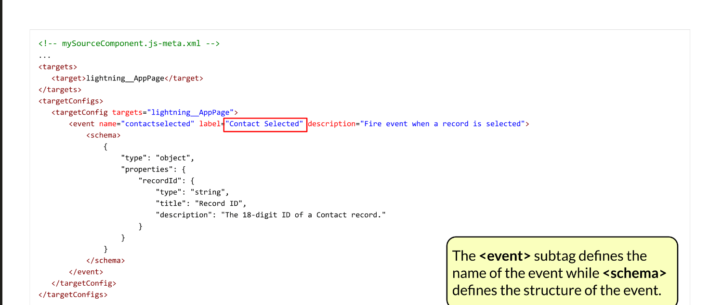

# LWC 

Un _componente_ è l’unione di un file HTML, JS (con un JS-META) e facoltativamente di un CSS; devono avere tutti lo stesso nome. Se si vuole richiamare un componente nel markup di un altro, il tag seguirà la corrispondenza nomeComponente ⬄ \<c-nome-Componente> (camelCase ⬄ kebab-case)

⚠️ Per poter utilizzare LWC ed Aura Components è necessario aver già deployato il _myDomain_ nella org

### File 

Se “nome” è il nome del componente LWC:

* _nome_.html: contiene soltanto il markup
* _nome_.js: contiene tutte le proprietà e funzioni del componente, sotto forma di classe JS
* \_\_tests\_\_/…/_nome._test.js: test da eseguire in locale
* _nome_.css: contiene le proprietà grafiche; con nome diverso si dichiarano file secondari
* _nome_.svg: icona personalizzata in SVG
* _nome_.js-meta.xml: contiene le informazioni sulla configurazione in Salesforce e dove è esposto il componente. È l’unico sempre presente

### Elementi notevoli del codice 

#### Html

* { espressione } ⚠️ _Senza punto esclamativo!_\
  Può restituire tipi primitivi, array, oggetti
* \<template>\
  Elemento _root_, è il contenitore per l’html del componente (sarà reso come\
  \<c-nome-componente>) o di sotto-componenti che non esistono separatamente
* \<c-nome-componente>\
  Inserisce un componente figlio definito separatamente
* **Direttive per \<template>**
* lwc:if={test} | lwc:elseif={test} | lwc:else\
  test deve esistere ed essere true perché l’elemento interno venga mostrato\
  ⚠️Non si possono negare valori con !
* for:each={lista} for:item="nomeElemento"\
  L’elemento interno di riferimento è ripetuto per ogni elemento della lista, valorizzando eventuali proprietà riferite secondo la variabile nomeElemento. Questo deve avere un attributo key che si comporta come un Id
* **Direttive per altri elementi**
* lwc:ref=”val” ⬄ nel JS: this.refs.val

#### Js

Importare i moduli principali

| **import…**                                                       | **from…**                                                                             | **Elemento importato**                                                  |
| ----------------------------------------------------------------- | ------------------------------------------------------------------------------------- | ----------------------------------------------------------------------- |
| LightningElement                                                  | lwc                                                                                   | Obbligatorio                                                            |
| DECORATORI                                                        | api                                                                                   | Espone proprietà o metodi                                               |
| wire                                                              | Scambia informazioni sui record con il DB                                             |                                                                         |
| track                                                             | Rende dinamici oggetti JS ed array                                                    |                                                                         |
| (singolarmente)                                                   | 
@salesforce/schema/ <em>ApiNameObj</em> <em>ApiNameObj.ApiNameCampo</em>
 | Schema dell'oggetto Salesforce                                          |
| 
get|create|update|

deleteRecord getRecords
        | lightning/uiRecordApi                                                                 | API UI record di Lightning                                              |
|                                                                   | 
@salesforce/apex/ <em>nomeClasse</em>.<em>nomeMetodo</em>
                   | Metodo Apex esposto                                                     |
| import { NavigationMixin } from 'lightning/navigation'            | lightning/navigation                                                                  | Lightning Navigation Service                                            |
| import { ShowToastEvent } from 'lightning/platformShowToastEvent' | lightning/platformShowToastEvent                                                      | Evento di toast per i messaggi di notifica                              |
|                                                                   | 
@salesforce/userPermission/ <em>nomePermission</em>
                         | Info permessi utente corrente                                           |
|                                                                   | @salesforce/user/_proprietà_                                                          | Info utente corrente                                                    |
|                                                                   | @salesforce/client/_proprietà_                                                        | Info dispositivo usato                                                  |
|                                                                   | c/_nomeComponente_                                                                    | Componente custom                                                       |
|                                                                   | @salesforce/resourceUrl/_nome_                                                        | Risorsa statica                                                         |
|                                                                   | 
@salesforce/contentAssetUrl /<em>nome</em>
                                  | Content Asset                                                           |
|                                                                   | 
@salesforce/label/

<em>nome</em> | c.<em>nomeCustom</em>
                 |                                                                         |
|                                                                   | @salesforce/i18n/_proprietà_                                                          | Localizzazione e internazionalizzazione                                 |
| loadStyle \| loadScript                                           | 
lightning/ platformResourceLoader
                                           | CSS e JS in risorsa statica; i metodi si usano con (this, _puntamento_) |
|                                                                   | ‘c/_nomeRisorsa’_                                                                     | Il JS, oppure il CSS, di nome coincidente con quello del componente     |

Esportare la classe

export default class NomeComponente extends LightningElement_DI SOLITO_ {…}

Lifecycle Hooks

* Metodi attivati all’ingresso in specifiche fasi della “vita” di un componente; non sono event listeners ma come per essi si può scrivere codice che deve essere eseguito.
* constructor()\
  Chiamato quando il componente è stato creato
* connectedCallback()\
  Chiamato quando il componente è stato collegato al DOM e ha ricevuto i dati iniziali.
* renderedCallback()\
  Chiamato quando il componente è stato reso graficamente.
* disconnectedCallback()\
  Chiamato quando il componente è stato scollegato dal DOM. Utilizzabile per eliminare cache, _event listeners…_
* errorCallback(error, stack)\
  Chiamato quando un discendente del componente in esame (non il componente stesso) solleva un’eccezione

Metodi e proprietà standard

* recordId e objectApiName: proprietà pubbliche per collegarsi ad Id ed Api Name
* this.template**:**\
  Fornisce accesso allo (shadow) DOM del componente. Per accedere ai suoi elementi si deve passare da qui
* this._nomeProprieta_: così si accede alle variabili “globali” (di istanza)
* static stylesheet: array ordinato di CSS aggiuntivi, dopo averli importati\
  Utilizzabile con …super.stylesheets per applicare uno stile ad un sottocomponente

#### Js-Meta

È il file di configurazione necessario a Salesforce.

* \<LightningComponentBundle>: contenitore
* \<apiVersion>
* \<isExposed> (Boolean)\
  possibilità di inserirlo _stand-alone_, dal Builder, in pagine e community; se _true_, ha bisogno di almeno un target
* \<targets>\[], e a parte \<targetConfigs>\[] con figli \<targetConfig targets=”…”> che li richiamano
* lightning\_\_HomePage
* lightning\_\_AppPage\
  targetConfig può contenere \<event name=”…”> con \<schema>, e \<property>, a legare impostazioni da interfaccia, eventi su componenti e record
* lightning\_\_RecordPage\
  targetConfig può contenere \<objects>\[]
* lightning\_\_RecordAction per Quick Action specifiche di oggetti\
  targetConfig contiene \<actionType> (=Action|ScreenAction)
* lightning\_\_FlowScreen per usare il componente in un flow\
  targetConfig espone proprietà _pubbliche_ nella classe come \<property> (vedi sotto)
* lightningCommunity\_\_Page
* lightning\_\_UtilityBar
* lightning\_\_Inbox per l’_Email Application Pane_
* \<property>\
  Per esporre proprietà settabili nelle impostazioni del componente, nell’App Builder o in un flow
* type = Boolean | Integer | String
* label, name (referenziato nella classe), default, required
* datasource = ”val1, val2, …”\
  per tipi String, mostrerà una picklist
* role = inputOnly | outputOnly\
  se la proprietà è in sola scrittura o lettura (default: entrambe)
* \<supportedFormFactors>, \<objects>\
  Come per gli Aura

### 👍Passaggio di dati tra le parti di un componente o più componenti 

#### Passaggio di dati dal JS al template

* Nel JS si definisce e valorizza la proprietà all’interno della classe
* Nel template la si richiama con le {parentesi graffe}

#### Passaggio di dati dal template al JS

Si impiegano eventi e funzioni che li gestiscano, sapendo che il componente che li ha generati sarà identificato da event.target

* Nel template, il componente presenta attributi del tipo:
* name = “prop”: per legarlo logicamente al _nome_ della proprietà nella classe
* value = {prop}: per legare il valore nel componente a quello della proprietà nella classe
* ontipoEvento = {funzioneHandler}: per invocare la funzione che modificherà il valore della proprietà
* Nella classe avremo:
* prop = “…”: la definizione iniziale della proprietà
  * funzHandler(event)={ this\[event.target.name] = event.target.value }

Quando invocata, la funzione handler accederà alla proprietà “prop” dell’istanza e la modificherà secondo il value; dopodiché il nuovo valore ritornerà al template laddove richiamato, e ne verrà mostrato il nuovo valore:

* In automatico se la proprietà è un campo semplice
* Se invece (generalizzando sopra) la proprietà modificata appartiene ad un oggetto più complesso, o è un elemento di un vettore, solo se essi sono stati decorati con @track quando dichiarati

#### Passaggio di dati da figlio a padre (“verso l’alto”) 

Nel figlio:

* La classe presenta un _evento_ dal tipo personalizzato, in cui i dati vengono passati in un oggetto come parametro:\
  constnomeEvento = new CustomEvent(‘tipoEvento’, { detail: dati… })
* Da qualche parte si genera l’evento con il metodo this.dispatchEvent(nomeEvento)
* ⚠️ Il **tipo** è importante, non il nome!

Nel padre:

* Nel template, sul componente del figlio è indicato quale _event handler_ attivare al verificarsi del **tipo** di evento in arrivo: on_tipoEvento_ = {funzioneHandler}
* Nella classe, l’handler può accedere ai dati dell’evento tramite event.detail

#### Passaggio di dati da padre a figlio (“verso il basso”)

* La classe del figlio ha proprietà o metodi pubblici, definiti in **camelCase** e decorati con @api\
  (meglio se si utilizzano proprietà private abbinate a _getter/setter_ pubblici)
* Nel padre si possono avere più scenari:
* Nel template, sul componente del figlio le proprietà sono richiamate in **kebab-case** ed impostate: \<c-figlio nome-proprieta = {valore} … > … \</c-figlio>
* Nella classe, si individua il figlio e si accede al metodo pubblico con eventuali parametri:\
  this.template.querySelector(‘c-figlio’).nomeMetodo(parametri)
* Nel template, si specifica il metodo del figlio da attivare al verificarsi di un evento…

#### Lightning Message Service

Si usa quando si deve comunicare con un componente Aura, una Visualforce o anche tra LWC nel caso in cui non si abbia controllo diretto di entrambi più un componente genitore (altrimenti si usano gli eventi).

* Metadato _Lightning Message Channel_\
  Contiene la struttura delle informazioni da scambiare
* isExposed: se è visibile a componenti di altri namespace _(false)_
* lightningMessageFields: uno per ogni proprietà, con
* fieldName
* (description)
* Classe del componente _publisher_
* import { publish, MessageContext } from 'lightning/messageService'
* importMSG\_CH from '@salesforce/messageChannel/nomeMsgChannel\_\_c
* @wire(MessageContext) messageContext\
  Con @wire, la sottoscrizione al canale viene rimossa in automatico quando questo viene distrutto (vedi unsubscribe()✳️)
* publish(this.messageContext, MSG\_CH, payload)\
  Pubblica il messaggio con le informazioni. payload è un oggetto in cui sono valorizzati gli attributi definiti nel metadato sopra
* Classe del componente _subscriber_
* import {subscribe, MessageContext} from 'lightning/messageService'
* importMSG\_CH from '@salesforce/messageChannel/nomeMsgChannel\_\_c
* @wire(MessageContext) messageContext
* Si esegue la sottoscrizione:\
  subscription = null;\
  subscribeToMessageChannel() {\
  this.subscription =subscribe(\
  this.messageContext, MSG\_CH, _listener(msg)_\
  );\
  }\
  Il metodo subscribe() richiede il contesto, il nome del canale e cosa fare con il messaggio in arrivo; restituisce un oggetto subscription salvato per controlli.
* ✳️ Solo se c’è una logica particolare secondo cui annullare la sottoscrizione,\
  si dovrà scrivere:\
  unsubscribeToMessageChannel() {\
  unsubscribe(this.subscription);\
  this.subscription = null;\
  }
* connectedCallback() { this.subscribeToMessageChannel(); }\
  Per assicurarsi che la sottoscrizione avvenga solo quando il componente è stato completamente inizializzato, ossia è stato collegato al DOM e ha ricevuto i dati iniziali

### 👍Comunicazione con il server 

Si possono usare:

* **Lightning Data Service**, lo standard
* Fa grande uso della cache per conservare informazioni sui record che condivide con tutti i componenti, riducendo il numero di chiamate al server
* Viene eseguito completamente in _user mode_
* Non concorre al limite di chiamate API
* Non è adatto a gestire più di un record per volta
* Non può essere impiegato per oggetti esterni, _person accounts_ e custom metadata
* Metodi Apex personalizzati
* Per gestire appieno operazioni su liste di record

#### LDS: Componentilightning-record -form | -view-form | -edit-form 

Il primo componente è quello più semplice, ha un layout automatico e può mostrare il record in sola lettura o meno a seconda delle impostazioni.

* Nel template, il componente presenta gli attributi:
* object-api-name,record-id, \[record-type-id]
* fields: i campi da mostrare nell’ordine passato
* mode
* readonly
* view: default se è fornitorecord-id; i campi sono editabili
* edit: per un form già in modalità di modifica (default se record-id non è fornito)
* onsubmit, oncancel, onsuccess, onerror: per riferirsi agli eventi principali
* Nella classe si hanno:
* import RIFERIMENTO\_OGG from ‘@salesforce/schema/_ApiOgg’_\
  da assegnare a object-api-name
* import RIF\_CAMPO\_N from ‘@salesforce/schema/_ApiOgg.ApiCampo’_\
  per ogni singolo campo desiderato; da assegnare in array a fields
* @api recordId da assegnare a record-id\
  Se il componente è inserito in una Record Page, i campi verranno popolati in automatico!
* gli event handler per azioni personalizzate (esiste un comportamento di default già pronto); all’oggetto JS del record eventualmente restituito si accede con event.detail

Gli altri due componenti hanno comportamenti ben distinti, ed il layout va costruito nei singoli campi e pulsanti.

#### Lightning Data Service @wire adapters

⚠️ Sempre scrivere import wire from ‘lwc’

getRecord

Per ricevere dati su un singolo record

* import { getRecord, getFieldValue } from 'lightning/uiRecordApi'
* import dello schema dei campi desiderati
* @wire(getRecord, {oggettoParametri})nomeProp\
  Si decora la proprietà che deve ricevere i dati, e nell’oggetto di parametri si specificano:
* recordId:'$recordId', che con ‘$…’ rende reattiva la proprietà intera\
  ⚠️Non this.recordId, perché all’inizializzazione this è ancora undefined
* fields:i campi necessari; dà errore se l’utente non ha accesso
* optionalFields: i campi facoltativi; non dà errore se l’utente non ha accesso
* Il sistema inserirà i valori in nomeProp.data, gli errori innomeProp.error;
* getFieldValue(this._nomeProp_.data, _SINGOLO\_CAMPO_)\
  restituisce il valore contenuto e va inserito in un _getter_ come get _nome_() { return… }

[getRecords](https://developer.salesforce.com/docs/platform/lwc/guide/reference-wire-adapters-records.html#syntax)

Per leggere più record anche di diversi oggetti. La chiamata @wire diventa:

@wire(getRecord, \[{oggettoParametri1}, {oggettoParametri2}, …]) nomeProp

Gli id di record vanno divisi per oggetto e specificati come lista nella proprietà recordIds (⚠️plurale)

createRecord

* import { createRecord } from 'lightning/uiRecordApi'
* import dello schema di oggetto e campi desiderati
* in un handler, si costruisce l’oggetto di tipo recordInput con i dati per creare il record, con le proprietà:
* apiName: NOME\_OGGETTO.objectApiName
* fields: mappa { \[NOME\_CAMPO.fieldApiName] : ‘valore1’, … }
* si passa tale oggetto come parametro alla funzione createRecord e si gestiscono gli esiti della _promise_ che restituisce:
* .then ( esitoOK => { logicaOK… })
* .catch( esitoKO => { logicaKO… })

updateRecord

Non si occupa del recupero del record, che va gestito a parte. Ha bisogno di:

* import { updateRecord } from 'lightning/uiRecordApi'
* import dello schema dei campi desiderati, compreso l’Id
* un oggetto di tipo recordInput con i nuovi valori dei campi:\
  { fields: { \[NOME\_CAMPO.fieldApiName] : ‘valore1’, … } }
* la chiamata updateRecord(recordInput) che dà una _promise_

deleteRecord

* import { deleteRecord } from 'lightning/uiRecordApi'
* in un handler, si chiama la funzione specificando direttamente l’id del record da eliminare
* si gestisce la _promise_ restituita

Decorare una funzione

Se si deve eseguire della logica sui valori ricevuti dal server prima di visualizzarli, si può decorare la funzione personalizzata seguendo questo schema:

* aggiungere, decorate con @api, anche le variabili data ed error
* la decorazione della funzione è sempre @wire e costruita allo stesso modo
* la funzione in sé deve:
* accettare un oggetto con proprietà {data, error}
* eseguire la logica desiderata e settare correttamente i valori della classe con\
  this. data | error
* ⚠️Considerare che la funzione può essere anche invocata più volte dal LDS, e pertanto dovrà in qualche punto settare this.error = undefined se ha lavorato data,\
  e this.data = undefined se ha lavorato un error

#### Metodi Apex

* Il metodo Apex deve:
* trovarsi in una classe a cui l’utente può accedere (cfr. Visualforce)
* essere public o global, e static
* essere annotato come @AuraEnabled ed eventualmente (cacheable = true)⚠️
* stabilire esso stesso se si devono rispettare FLS, CRUD e Sharing rules
* Nella classe JS del componente si hanno:
* import nomeMetodo from ‘@salesforce/apex/nomeClasse.nomeMetodo’
* se si deve costruire una tabella di record, una lista di oggetti “colonna” di cui definire:
* label
* fieldName: NOME\_CAMPO.fieldApiName, importati ciascuno dallo schema
* type: currency, text, …
* decorate con @api le eventuali proprietà, impostabili dall’esterno, i cui valori verranno passati come parametri al metodo
* la chiamata al metodo, in uno di questi due modi:
* @wire(_nomeMetodo_, { _par1_: ‘$_proprieta1_’, … }) _nomeVar_\
  cioè assegnando il risultato ad una proprietà _wired_; i parametri vengono passati\
  in modo che siano reattivi, rieseguendo il metodo in caso di variazioni\
  ⚠️Solo se il metodo è cacheable
* _nomeMetodo_({ _par1_: this._proprieta1_, … })\
  cioè la _chiamata imperativa_ al metodo, eseguita in risposta ad un evento personalizzato, che restituisce una _promise_ da gestire opportunamente con\
  .then … .catch …
* Nel template del componente si può avere una lightning-datatable che accede al risultato finale con data = {_nomeVar_.data}, e definendo la lista di colonne in columns

La cache del metodo Apex, se abilitata, è separata da quella del Lightning Data Service; se necessario si deve importare ed usare il metodo refreshApex(this._proprieta_) che può essere una proprietà _wired_\
(caso 1) oppure la proprietà modificata da una funzione _wired_, e restituisce una _promise._

⚠️ Un metodo _cacheable_ può solo leggere dati e record ma non modificarli, fare update…

### Componenti notevoli 

#### Navigation Service 

Per spostarsi in specifiche pagine indicate mediante l’oggetto _PageReference_, con le proprietà\
type (tipologia di pagina di destinazione), attributes e state. È necessario:

* importare il NavigationMixin dal modulo lightning/navigation
* dichiarare la classe come estensione di NavigationMixin(LightningElement)
* usarlo in una funzione scrivendo this\[NavigationMixin.Navigate]\(_oggettoPageReference_)

Gli usi principali sono:

|                    | **type**                | **attributes** | **state**                            |   |
| ------------------ | ----------------------- | -------------- | ------------------------------------ | - |
| **Tab di oggetto** | standard\_\_objectPage  | objectApiName… | 
actionName:

home
        |   |
| **List view**      | list                    | filtername…    |                                      |   |
| **Record Page**    | standard\_\_recordPage  | recordId…      | 
actionName:

edit | view
 |   |
| **Custom Tab**     | standard\_\_navItemPage | apiName…       |                                      |   |
| **Url**            | standard\_\_webPage     | url…           |                                      |   |

#### lightning-flow

* Inserisce uno screen flow nel componente
* Template
* \[flow-finish-behavior=”NONE|RESTART”]: cosa avviene al termine di una interview
* flow-interview-id: per recuperare una interview in pausa; alternativo a quanto sotto
* flow-api-name: per avviarne una nuova, specificando il nome del flow
* flow-input-variables: una lista di variabili di ingresso
* JS
* statuschange è l’evento che si verifica ad ogni nuovo step, e sotto .detail compaiono tra gli altri:
* outputVariables (lista)
* status = “STARTED | PAUSED | FINISHED | FINISHED\_SCREEN (flow senza screen) | ERROR”
* .resumeFlow(interviewId)
* .startFlow(apiName, inputVariables)

#### lightning-modal 

Classe con cui costruire separatamente dei componenti che mostrino modali

* Template
* lightning-modal-body, e facoltativamente -header | -footer
* JS
* Stavolta la classe deve estendere LightningModal

#### lightning-emp-api

Per sottoscriversi ad un Platform Event

* Template
* (esempio) si hanno bottoni per eseguire o revocare la sottoscrizione, che chiamano opportuni handler; oppure la si esegue a componente inizializzato con connectedCallback()
* JS
* import { subscribe, unsubscribe, onError, setDebugFlag, isEmpEnabled } from ‘lightning/empApi’
* channelName = ‘/event/nomePlatformEvent\_\_e’
* @track subscription = {}
* const messageCallback = function (response) { trattamento… }\
  response.data.payload contiene i campi del messaggio
* subscribe(this.channelName, replayId, messageCallback)
* replayId è il valore da cui cominciare; -1 significa “dalla testa”
* messageCallback è la funzione che tratterà il messaggio
* il metodo restituisce una promise che viene assegnata a subscription

### Differenze con gli Aura 

1. Le variabili sono nella classe JS e non più nel markup del componente
2. Diminuiscono i legami e richiami espliciti tra elementi differenti all’interno del markup _(two-way binding)_, perché queste relazioni sono incorporate nella logica basata sugli eventi, posta nel JS
3. Il JS di un LWC è strutturato come un’unica classe, mentre i più file JS di un Aura sono piuttosto un insieme di funzioni
4. Un componente Aura viene esposto richiamando implementazioni di specifiche interfacce nel markup, mentre un LWC ha l’apposito file js-meta.xml

  

### Note 

1. [Lightning Web Components and Aura Components Reference](https://developer.salesforce.com/docs/component-library/overview/components?\_ga=2.44336804.1462165938.1701080731-1875400034.1696324836)
2. Modulo [https://trailhead.salesforce.com/content/learn/trails/build-lightning-web-components](https://trailhead.salesforce.com/content/learn/trails/build-lightning-web-components)

* Da _Lightning Components > LWC Dependencies_ si possono vedere tutte le dipendenze di un LWC
* Si possono attraversare consecutivamente fino a 5 relazioni da figlio a padre, ed una volta sola passare dal padre ai figli (“five up, one down”)
* Esporre Flexipage attribute
* static renderMode = "light" in JS + lwc:render-mode="light" in \<template> per rendere il componente nel Light DOM
* Variabili nel CSS indicate con var(…) contenente:
* \--lwc-_nome_ se globale
* \--c-_nome_ se ereditato da un _Aura token_
* \--_nome_ se definito dentro all’elemento :host dello stesso css, come --_nome_: _valore_
* @mock
* API REST o SOAP per comunicare con servizi esterni